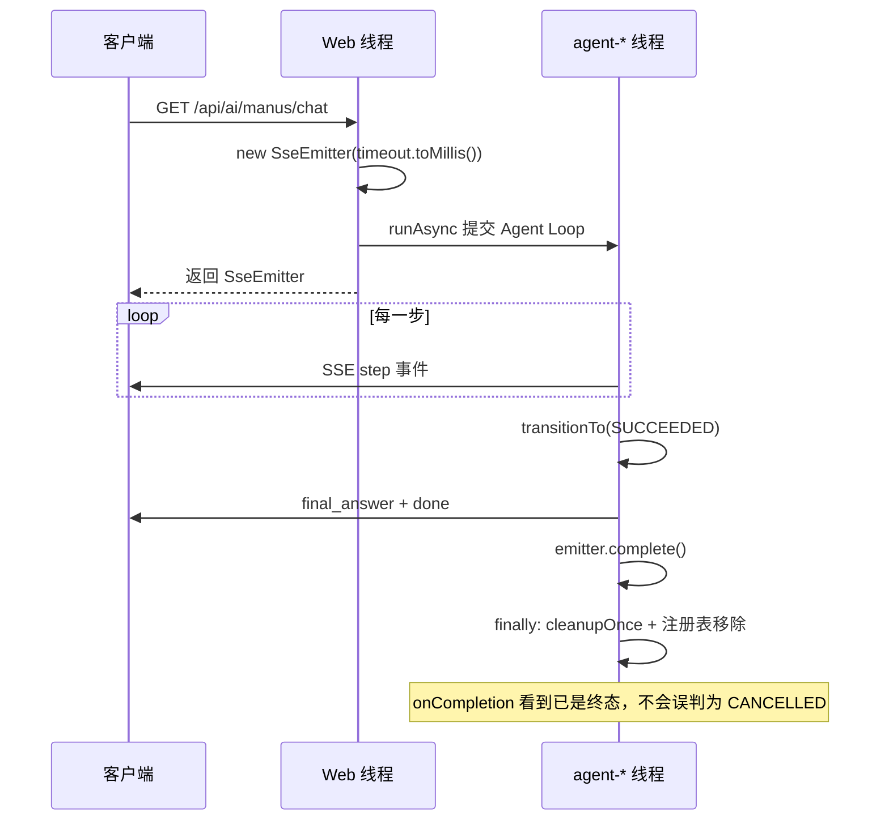
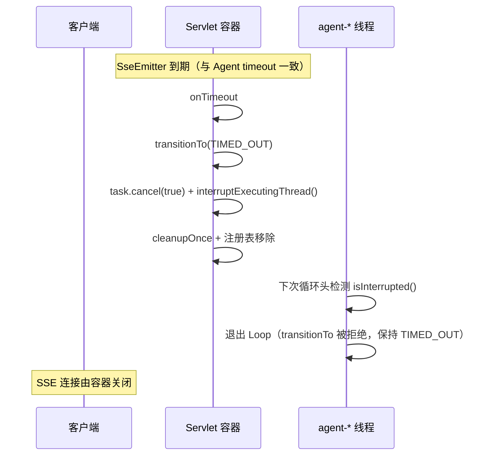
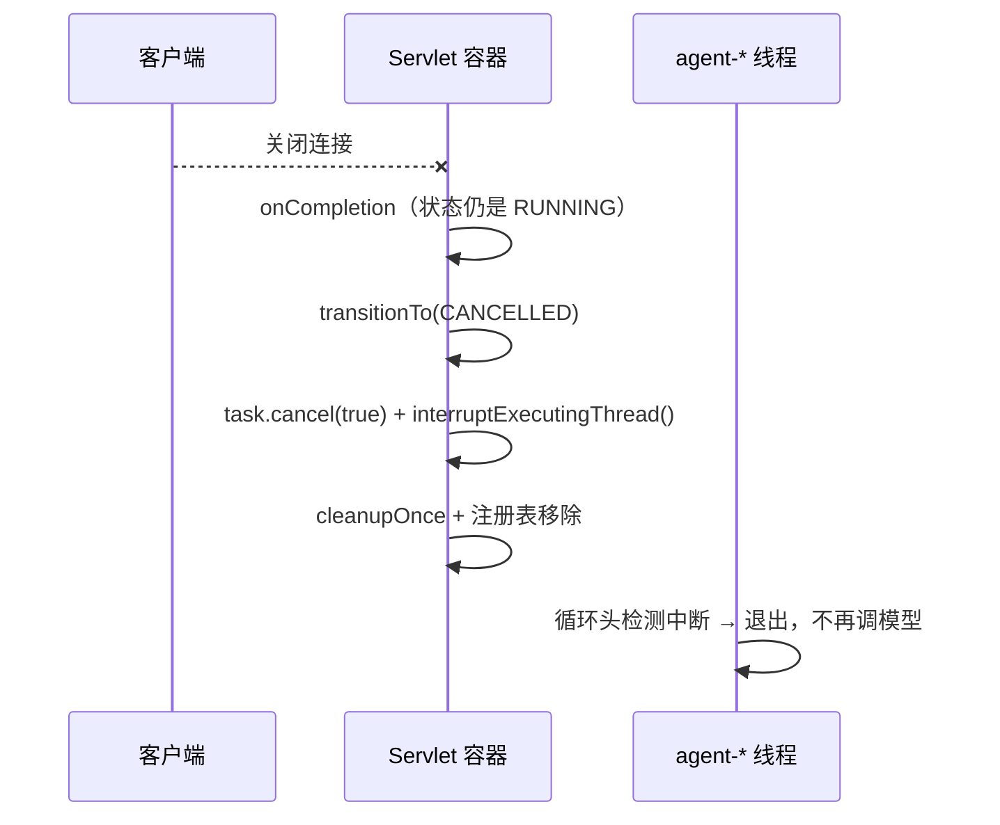
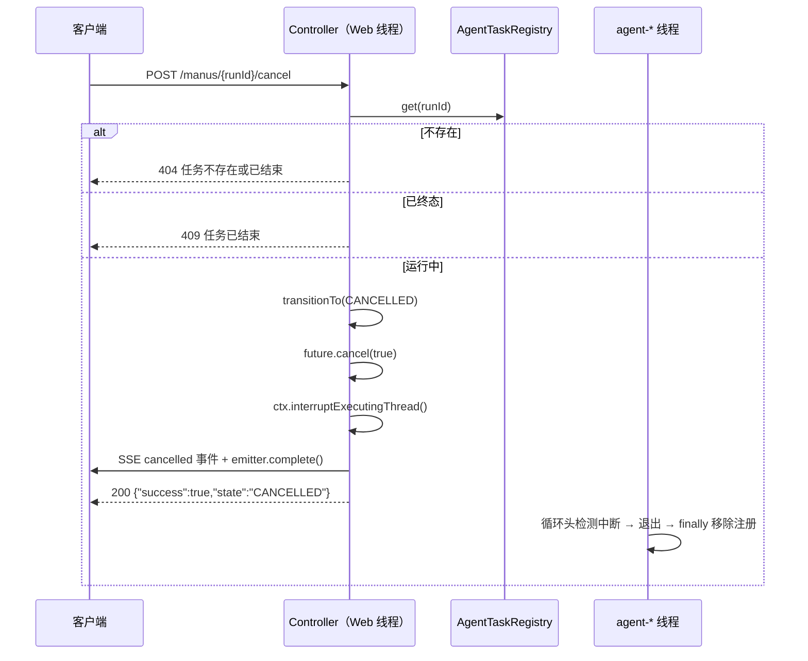
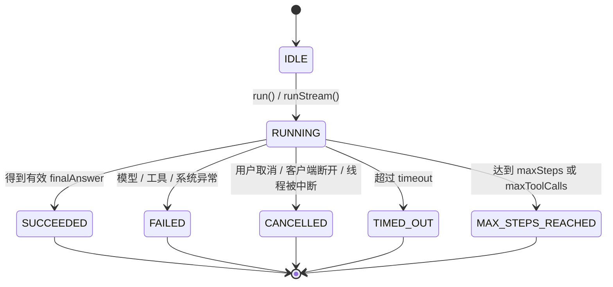

# 02 - Agent 状态机与任务取消

> 本文档与当前代码库完全一致，面向已有 Java / Spring Boot 基础、正在学习 Agent 异步执行的开发者。
> 所有类名、方法名、代码片段均来自本项目真实实现，无伪代码。

---

## 1. 本次功能目标

### 1.1 为什么原来的 FINISHED / ERROR 不够

改造前的 `AgentState` 只有 `FINISHED` 和 `ERROR` 这类语义宽泛的状态：

| 问题 | 具体表现 |
| --- | --- |
| 无法区分"怎么结束的" | 模型正常给出答案、达到最大步数被安全停止、运行超时，全部是 `FINISHED`，无法统计、无法给用户准确反馈 |
| 无法区分"为什么失败" | 模型调用异常、用户主动取消、客户端断开连接，全部是 `ERROR`，取消会被误报成系统故障 |
| 没有终态保护 | 状态是普通字段，谁都能改。任务线程刚设置 `FINISHED`，SSE 的 `onCompletion` 回调又可能把它改成别的状态 |
| 无法管理运行中任务 | 没有注册表，Controller 拿不到正在运行的任务，用户想"停止"都找不到入口 |

### 1.2 本次目标

1. **状态机**：`IDLE / RUNNING / SUCCEEDED / FAILED / CANCELLED / TIMED_OUT / MAX_STEPS_REACHED`，终态不可被覆盖；
2. **运行中任务注册表**：`AgentTaskRegistry`（Spring Bean，`ConcurrentHashMap` 内存实现）；
3. **主动取消接口**：`POST /api/ai/manus/{runId}/cancel`；
4. **SSE 超时 / 连接完成处理**：`onTimeout` → `TIMED_OUT`，`onCompletion` 仍是 `RUNNING` → `CANCELLED`；
5. **可观测日志**：runId、状态、步数、工具调用次数、线程名、总耗时。

---

## 2. 实现前项目状态

改造前 `runStream()` 已经具备的能力：

- 用 `CompletableFuture.runAsync(..., agentExecutor)` 把 Agent Loop 放到 `agent-*` 后台线程；
- 返回 `SseEmitter` 推送 `status / step / final_answer / done` 事件；
- 有 `cleanupOnce(ctx, cleaned)`（`AtomicBoolean` CAS）防止重复清理。

但存在这些不足：

| 不足 | 后果 |
| --- | --- |
| 状态只有 `FINISHED / ERROR` | 无法区分超时、取消、达到步数上限 |
| `SseEmitter` 用默认超时 | 与 Agent 任务 timeout 不一致，SSE 可能比任务先超时 |
| 没有 `onTimeout` / `onCompletion` 处理 | 客户端断开后后台任务继续烧钱调模型 |
| 正常完成没有先置终态再 `emitter.complete()` | `onCompletion` 无法区分"正常完成"与"客户端断开" |
| 没有任务注册表 | 无法按 runId 找到任务并取消 |
| 误以为 `future.cancel(true)` 能停线程 | `CompletableFuture` 的 `cancel(true)` 实际上**不会中断执行线程** |

---

## 3. 核心概念

### 3.1 AgentState：带终态保护的状态机

真实代码见 [AgentState](file:///D:/mk-agent/src/main/java/com/example/mkagent/model/AgentState.java)：

```java
public enum AgentState {
    IDLE, RUNNING,
    SUCCEEDED, FAILED, CANCELLED, TIMED_OUT, MAX_STEPS_REACHED;

    public boolean isTerminal() {
        return this == SUCCEEDED || this == FAILED || this == CANCELLED
                || this == TIMED_OUT || this == MAX_STEPS_REACHED;
    }
}
```

状态转换统一入口在 `AgentRunContext.transitionTo`（`synchronized` + 终态拒绝）：

```java
public synchronized boolean transitionTo(AgentState next) {
    if (state.isTerminal()) {
        return false;   // 已结束的任务不允许再改状态
    }
    if (state == next) {
        return false;   // 无意义变更
    }
    this.state = next;
    return true;
}
```

这一个方法同时解决了三个竞态问题：

1. 已结束任务被重新标记为 `RUNNING`；
2. `SUCCEEDED` 被 `onCompletion` 误判成 `CANCELLED`；
3. 取消接口与任务线程同时写状态互相覆盖（先到的终态获胜）。

### 3.2 Future 与 CompletableFuture

- `Future`：异步任务的句柄，可 `cancel` / `get` / `isDone`；
- `CompletableFuture`：可链式编排（`thenApply` / `whenComplete`），本项目的异步任务由 `CompletableFuture.runAsync(runnable, agentExecutor)` 提交。

**关键陷阱**：`CompletableFuture.cancel(true)` 的 `mayInterruptIfRunning` 参数**无效**，它不会中断正在执行的线程。所以本项目额外记录了执行线程：

```java
// AgentRunContext
private volatile Thread executingThread;

public void interruptExecutingThread() {
    Thread thread = executingThread;
    if (thread != null) {
        thread.interrupt();
    }
}
```

### 3.3 线程中断

`Thread.interrupt()` 只是"打一个标记"，线程是否停下来取决于它自己是否检查：

- 处于 `sleep` / `wait` / 响应中断的 IO 时，会立即抛 `InterruptedException`；
- 处于纯 CPU 计算或不响应中断的阻塞调用时，要等代码主动检查。

因此 Agent Loop 的循环头必须显式检测（见 `BaseAgent.runStream`）：

```java
while (canContinue(ctx)) {
    if (Thread.currentThread().isInterrupted()) {
        ctx.transitionTo(AgentState.CANCELLED);
        break;   // 不再进入下一轮 step
    }
    ctx.nextStep();
    // ... step(ctx)
}
```

### 3.4 ConcurrentHashMap 任务注册表

注册、查询、移除发生在不同线程（Tomcat Web 线程 / `agent-*` 后台线程），所以用 `ConcurrentHashMap` 而不是 `HashMap`。真实代码见 [AgentTaskRegistry](file:///D:/mk-agent/src/main/java/com/example/mkagent/agent/AgentTaskRegistry.java)。

### 3.5 cleanupOnce

多个出口（任务线程 `finally`、`onTimeout`、`onCompletion`、取消接口）都可能触发清理，用 `AtomicBoolean.compareAndSet(false, true)` 保证只执行一次：

```java
public void cleanupOnce(AgentRunContext ctx, AtomicBoolean cleaned) {
    if (cleaned.compareAndSet(false, true)) {
        cleanup(ctx);
    }
}
```

---

## 4. 四条路径流程图

### 4.1 正常完成



文本版：

```
客户端 → GET /manus/chat → Web 线程创建 emitter、注册任务 → 提交 agent-* 线程
agent-* 线程 → 循环 step → 得到 finalAnswer → transitionTo(SUCCEEDED)
→ 发送 final_answer / done → emitter.complete() → finally 清理 + 移除注册
→ onCompletion 发现状态已是 SUCCEEDED → 只记日志，不改状态
```

### 4.2 超时



文本版：

```
SseEmitter 到期 → 容器线程触发 onTimeout → transitionTo(TIMED_OUT)（先到先赢）
→ task.cancel(true) + ctx.interruptExecutingThread() → cleanupOnce + 移除注册
agent-* 线程 → 循环头发现 isInterrupted() → 想置 CANCELLED 但被终态保护拒绝 → 退出
```

### 4.3 客户端提前断开



文本版：

```
客户端关闭连接 → 容器触发 onCompletion → 发现状态仍是 RUNNING
→ 判定为"客户端提前断开" → transitionTo(CANCELLED) → cancel + 中断执行线程
→ cleanupOnce + 移除注册 → agent-* 线程在循环头退出
```

### 4.4 主动取消（取消接口）



文本版：

```
客户端 → POST cancel → Controller 按 runId 查注册表
→ 不存在: 404；已终态: 409
→ 运行中: transitionTo(CANCELLED)（终态保护，先写先赢）
→ future.cancel(true) + interruptExecutingThread()
→ 向 SSE 发 cancelled 事件并 complete → 返回 200
agent-* 线程 → 循环头检测中断退出 → finally 移除注册（取消接口不重复移除）
```

---

## 5. 文件清单

### 5.1 新增

| 文件 | 作用 |
| --- | --- |
| `src/main/java/com/example/mkagent/model/RunningAgentTask.java` | record，保存一次运行中任务的 `AgentRunContext` + `CompletableFuture<Void>` 句柄 |
| `src/main/java/com/example/mkagent/agent/AgentTaskRegistry.java` | Spring Bean，`ConcurrentHashMap<String, RunningAgentTask>` 进程内注册表 |
| `src/main/java/com/example/mkagent/exception/BusinessException.java` | 携带 HTTP 状态码的业务异常（404 任务不存在 / 409 状态冲突） |
| `src/main/java/com/example/mkagent/exception/GlobalExceptionHandler.java` | `@RestControllerAdvice`，把 `BusinessException` 转成带状态码的 JSON |
| `src/test/java/com/example/mkagent/agent/AgentStateMachineUnitTest.java` | 11 个纯单元测试：不启 Spring、不触网 |
| `src/test/java/com/example/mkagent/agent/AgentTaskCancelIntegrationTest.java` | 取消接口集成测试：真实 HTTP + 假模型，不触网 |

### 5.2 修改

| 文件 | 改动 |
| --- | --- |
| `src/main/java/com/example/mkagent/model/AgentState.java` | 重写为 7 状态 + `isTerminal()` |
| `src/main/java/com/example/mkagent/model/AgentRunContext.java` | 新增 `transitionTo()`、`executingThread` 字段与中断方法 |
| `src/main/java/com/example/mkagent/agent/BaseAgent.java` | 状态流转、注册/移除、中断检测、超时判定、`onTimeout/onCompletion`、日志汇总 |
| `src/main/java/com/example/mkagent/agent/ToolCallAgent.java` | 2 处 `setState(FINISHED)` → `transitionTo(SUCCEEDED)` |
| `src/main/java/com/example/mkagent/agent/MkManus.java` | 构造器注入 `AgentTaskRegistry` |
| `src/main/java/com/example/mkagent/controller/AiController.java` | 新增 `POST /manus/{runId}/cancel` |
| `src/test/java/com/example/mkagent/agent/MkManusAsyncSseIntegrationTest.java` | 排除 MCP 客户端自动配置 + 提供空 `ToolCallbackProvider` 桩，测试不再依赖外部 MCP 服务 |

### 5.3 删除

无。

---

## 6. 关键代码讲解

### 6.1 任务注册：先注册，再提交

`BaseAgent.runStream()` 中注册顺序是刻意设计的：

```java
CompletableFuture<Void> task = new CompletableFuture<>();

if (taskRegistry != null) {
    taskRegistry.register(runId, new RunningAgentTask(ctx, task));
}

CompletableFuture.runAsync(() -> {
    ctx.setExecutingThread(Thread.currentThread());
    // ... Agent Loop
}, agentExecutor).whenComplete((result, error) -> {
    if (error != null) {
        task.completeExceptionally(error);
    } else {
        task.complete(null);
    }
});
```

如果反过来"先提交后注册"，存在竞态窗口：任务可能已经执行完并从注册表移除，随后才被注册，导致注册表残留已结束任务。单元测试 `runStreamRegistersTaskAndRemovesOnCompletion` 用同步执行器把这个窗口放大成必现，专门盯住这个顺序。

### 6.2 future.cancel(true) 为什么还不够

```java
CompletableFuture<Void> future = task.future();
if (future != null) {
    future.cancel(true);          // 只改变 Future 状态，不中断线程
}
ctx.interruptExecutingThread();   // 真正中断 agent-* 线程
```

`cancel(true)` 让 `future.isCancelled()` 为 true、`join()` 抛 `CancellationException`，但 `CompletableFuture` 不保存执行线程，无法中断它。真正让 Agent Loop 停下来的是第二行的显式 `interrupt()` + 循环头的 `isInterrupted()` 检测。

同时要有心理预期：如果线程正卡在一次不响应中断的模型 HTTP 调用里，中断要等该调用返回、到达下一个检测点才生效。

### 6.3 onTimeout

```java
emitter.onTimeout(() -> {
    ctx.transitionTo(AgentState.TIMED_OUT);
    log.warn("SSE 连接超时：runId={}, state={}, step={}, thread={}, duration={}ms", ...);
    task.cancel(true);
    ctx.interruptExecutingThread();
    cleanupOnce(ctx, cleaned);
    unregisterTask(runId);
});
```

`SseEmitter` 构造时传入 `timeout.toMillis()`，与 Agent 任务超时对齐，保证"任务超时"和"连接超时"是同一时刻的同一件事。

### 6.4 onCompletion 与"不误判"

```java
emitter.onCompletion(() -> {
    if (ctx.getState() == AgentState.RUNNING) {
        ctx.transitionTo(AgentState.CANCELLED);   // 视为客户端提前断开
        task.cancel(true);
        ctx.interruptExecutingThread();
    } else {
        log.info("SSE 连接完成：runId={}, state={}", runId, ctx.getState());
    }
    cleanupOnce(ctx, cleaned);
    unregisterTask(runId);
});
```

关键点：正常完成路径是**先** `transitionTo(SUCCEEDED)`（或别的终态）、发完 `done` 事件，**再** `emitter.complete()`。`onCompletion` 执行时状态已是终态，走 else 分支，不会被误判成取消。

### 6.5 取消接口

```java
@PostMapping("/manus/{runId}/cancel")
public Map<String, Object> cancelManusTask(@PathVariable String runId) {
    RunningAgentTask task = agentTaskRegistry.get(runId);
    if (task == null) {
        throw new BusinessException(404, "任务不存在或已结束：" + runId);
    }
    AgentRunContext ctx = task.context();
    if (ctx.getState().isTerminal()) {
        throw new BusinessException(409, "任务已结束，无法取消。当前状态：" + ctx.getState());
    }
    boolean cancelled = ctx.transitionTo(AgentState.CANCELLED);
    if (!cancelled) {
        throw new BusinessException(409, "任务状态已变更，无法取消。当前状态：" + ctx.getState());
    }
    // future.cancel(true) + ctx.interruptExecutingThread() + SSE cancelled 事件 ...
}
```

注意最后一道 `transitionTo` 检查：在 `isTerminal()` 判断和写状态之间，任务线程可能刚好完成，`transitionTo` 返回 false 就如实告诉客户端"状态已变更"。

---

## 7. 手撕实现步骤

按依赖顺序做，每步都能单独编译验证：

### 第 1 步：AgentState

- 文件：`model/AgentState.java`
- 内容：7 个枚举值 + `isTerminal()`
- 验证：编译通过；旧 `FINISHED / ERROR` 的引用处全部报红，顺着报红逐个替换

### 第 2 步：AgentRunContext 状态转换

- 新增字段：`executingThread`（volatile）
- 新增方法：`transitionTo(next)`（synchronized，终态拒绝，返回 boolean）、`setExecutingThread`、`interruptExecutingThread`
- 验证：写 `terminalStateCannotBeOverwritten` 断言

### 第 3 步：RunningAgentTask + AgentTaskRegistry

- record：`RunningAgentTask(AgentRunContext context, CompletableFuture<Void> future)`
- `@Component` 注册表：`register / remove / get / contains / size / snapshot`
- 验证：`registryRegistersAndRemovesTask` 断言

### 第 4 步：BaseAgent 重构（核心）

- `runStream()`：
  - 字段：`new SseEmitter(timeout.toMillis())`
  - 先创建 `CompletableFuture` 句柄并注册，再 `runAsync`，`whenComplete` 回写结果
  - lambda 首行 `ctx.setExecutingThread(Thread.currentThread())`
  - 循环头加 `isInterrupted()` 检测 → `CANCELLED` + break
  - 循环退出后 `finishIfStillRunning(ctx)`：超时 → `TIMED_OUT`；有 finalAnswer → `SUCCEEDED`；否则 → `MAX_STEPS_REACHED`
  - catch：`failOrCancel(ctx, e)`（中断相关 → `CANCELLED`，否则 `FAILED`）
  - finally：`logTaskSummary` + `cleanupOnce` + `unregisterTask`
  - `onTimeout` / `onCompletion` 按 6.3 / 6.4 实现
- 验证：跑 `AgentStateMachineUnitTest` 全部用例

### 第 5 步：子类状态替换

- `ToolCallAgent`：`setState(FINISHED)` → `transitionTo(SUCCEEDED)`（think 无工具调用分支、terminate_task 分支）
- `MkManus`：构造器注入 `AgentTaskRegistry` 并 `setTaskRegistry(...)`

### 第 6 步：异常处理与取消接口

- `BusinessException` + `GlobalExceptionHandler`
- `AiController.cancelManusTask` 按 6.5 实现
- 验证：跑 `AgentTaskCancelIntegrationTest`

---

## 8. 状态流转图



约束：**五个终态之间、终态到任何状态**的转换全部被 `transitionTo` 拒绝。

---

## 9. 测试

### 9.1 测试命令

```powershell
# 状态机单元测试（11 个，不启 Spring、不触网）
.\mvnw.cmd test "-Dtest=AgentStateMachineUnitTest"

# 取消接口集成测试（2 个，真实 HTTP + 假模型）
.\mvnw.cmd test "-Dtest=AgentTaskCancelIntegrationTest"

# 既有异步 SSE 链路回归
.\mvnw.cmd test "-Dtest=MkManusAsyncSseIntegrationTest"
```

### 9.2 测试输入与预期

| 用例 | 输入 | 预期 |
| --- | --- | --- |
| `succeededWhenFinalAnswerProduced` | step 中写入 finalAnswer 并置 SUCCEEDED | 终态 `SUCCEEDED`，返回值是 finalAnswer |
| `maxStepsReachedWhenStepBudgetExhausted` | maxSteps=3，step 永不结束 | 终态 `MAX_STEPS_REACHED`，步数=3 |
| `maxStepsReachedWhenToolCallBudgetExhausted` | maxToolCalls=2，每步 +1 工具 | 终态 `MAX_STEPS_REACHED` |
| `timedOutWhenRunningLongerThanTimeout` | timeout=80ms，每步 sleep 30ms | 终态 `TIMED_OUT` |
| `failedWhenStepThrowsException` | step 抛 `IllegalStateException` | 终态 `FAILED` |
| `cancelStopsLoopAndPreventsFurtherSteps` | 长任务 + 模拟取消三步 | 终态 `CANCELLED`，取消后步数不再增长，注册表移除 |
| `cleanupOnceNeverRunsTwice` | 连续调用 3 次 `cleanupOnce` | cleanup 只执行 1 次 |
| `cleanupRunsExactlyOncePerRun` | 正常 + 异常两条路径 | 各只执行 1 次 |
| `registryRegistersAndRemovesTask` | register → remove | contains/size 正确 |
| `runStreamRegistersTaskAndRemovesOnCompletion` | 同步执行器跑完整个 runStream | 结束后注册表为空（盯注册顺序竞态） |
| `terminalStateCannotBeOverwritten` | SUCCEEDED 后再转 RUNNING / CANCELLED | 全部返回 false |
| `cancelRunningTaskThroughHttpApi` | SSE 长任务 + HTTP 取消 | 200 + CANCELLED；模型只调 1 次；线程被中断；注册表移除；SSE 含 `event:cancelled`；二次取消 404 |
| `cancelUnknownRunIdReturns404` | 取消不存在的 runId | 404 + "任务不存在或已结束" |

### 9.3 实际测试结果

```
Tests run: 11, Failures: 0, Errors: 0 -- AgentStateMachineUnitTest   (0.619 s)
Tests run: 2,  Failures: 0, Errors: 0 -- AgentTaskCancelIntegrationTest (12.48 s)
Tests run: 1,  Failures: 0, Errors: 0 -- MkManusAsyncSseIntegrationTest  (2.175 s)
BUILD SUCCESS（以上三组）
```

### 9.4 关于全量测试中的既有失败

全量 `.\mvnw.cmd test` 中有 11 个**存量**错误（`MkManusTest`、`chatAppTest`、`WebSearchToolTest`、`MkAgentApplicationTests` 等），根因链条全部是：

```
MkAgentApplicationTests.contextLoads
  → mcpToolCallbacks → mcpSyncClients
  → McpError: Failed to wait for the message endpoint
```

即这些测试加载完整 Spring 上下文，启动时 MCP 客户端自动配置要真实拉起 `mcp-servers.json` 中的外部 MCP 服务（npx / 本地 jar），当前环境连不上。这与本次状态机改动无关（失败链上没有任何本次新增/修改的类），属于环境依赖型测试，不在本任务范围内处理。

---

## 10. 常见问题排查表

| 现象 | 原因 | 排查 / 修复 |
| --- | --- | --- |
| 取消后任务还在跑、还在调模型 | 只调了 `future.cancel(true)`，没有中断执行线程 | `CompletableFuture.cancel(true)` 不中断线程，必须 `ctx.interruptExecutingThread()` + Loop 中 `isInterrupted()` 检测 |
| 正常完成却被记成 CANCELLED | 先 `emitter.complete()` 后设状态，`onCompletion` 看到 RUNNING | 保证顺序：先 `transitionTo(SUCCEEDED)`（终态）→ 发 `done` → 再 `emitter.complete()` |
| cleanup 被执行多次 | 多个出口（finally / onTimeout / onCompletion）都直接调 `cleanup` | 统一走 `cleanupOnce(ctx, cleaned)`，用 `AtomicBoolean.compareAndSet` |
| SSE 已断开但继续 `send` 抛异常 | 客户端断开后 `send` 抛 `IOException`；`complete()` 后 `send` 抛 `IllegalStateException` | `sendEvent` 同时捕获两种异常：`IOException` 降级 warn、`IllegalStateException` 记 debug 跳过 |
| 注册表残留已结束任务 | 先提交任务后注册，任务跑完被移除后才注册进去 | 先创建句柄并注册，再 `runAsync`，`whenComplete` 回写结果 |
| 取消接口返回成功但状态不是 CANCELLED | 竞态：检查时还在运行，写状态时任务刚完成 | 以 `transitionTo` 的返回值为准，失败就返回 409 并告知当前状态 |
| 二次取消返回 409 还是 404？ | 任务线程 finally 已移除注册表 | 按本项目实现返回 404（"任务不存在或已结束"），集成测试以此为准 |
| 超时了但状态是 CANCELLED 不是 TIMED_OUT | `onTimeout` 设置 `TIMED_OUT` 前任务线程刚好因别的原因退出 | `transitionTo` 先写先赢，属于预期竞态；排查时看 `Agent 任务结束` 汇总日志的时间顺序 |

---

## 11. 面试题

### 题 1：`CompletableFuture.cancel(true)` 能中断正在执行的线程吗？

- **考察点**：对 `CompletableFuture` 与 `FutureTask` 差异的理解。
- **参考回答要点**：不能。`CompletableFuture` 的 `mayInterruptIfRunning` 参数被忽略，它不保存执行线程；`cancel` 只是把 Future 置为已取消，让 `join()/get()` 抛 `CancellationException`。要真正停下任务，需要自己记录执行线程并 `interrupt()`，且任务内部要有中断检测点。
- **常见错误回答**："传 true 就会中断线程"（把 `FutureTask` 的行为套到 `CompletableFuture` 上）。

### 题 2：为什么任务状态要做"终态不可覆盖"？

- **考察点**：并发场景下的状态一致性。
- **参考回答要点**：任务线程、取消接口、SSE 回调三方会并发写状态；用 `synchronized` + "终态拒绝"保证先到达的终态获胜，避免：正常完成被 `onCompletion` 改写成 `CANCELLED`、已结束任务被重新置 `RUNNING`。
- **常见错误回答**：只说"加锁就线程安全了"，说不出覆盖的具体场景。

### 题 3：`onCompletion` 怎么区分"正常完成"和"客户端断开"？

- **考察点**：`SseEmitter` 生命周期。
- **参考回答要点**：`onCompletion` 在任何关闭路径都会触发，本身不带原因。做法是：正常完成路径先把状态置为终态再 `emitter.complete()`；回调里发现仍是 `RUNNING` 才判定为客户端断开并置 `CANCELLED`。
- **常见错误回答**：以为 `onCompletion` 只在客户端断开时触发。

### 题 4：`interrupt()` 之后线程一定会立刻停吗？

- **考察点**：Java 中断模型。
- **参考回答要点**：`interrupt()` 只设标记。处于 `sleep/wait` 或响应中断的 IO 会立即抛 `InterruptedException`；纯计算或不响应中断的阻塞（某些 HTTP 客户端调用）要等到代码主动检查 `isInterrupted()`。所以必须在循环头等位置布置检测点，且不能假设底层模型 HTTP 请求立即停止。
- **常见错误回答**："interrupt 就是强制杀线程"（混淆已废弃的 `Thread.stop()`）。

### 题 5：取消接口为什么要"先置状态再中断"，而不是反过来？

- **考察点**：取消操作的原子性与意图表达。
- **参考回答要点**：先把 `CANCELLED` 写进状态机（受终态保护），用户的取消意图就不会被任务线程后续的 `SUCCEEDED/FAILED` 覆盖；然后再中断线程。若反过来，任务线程可能在中断到达前刚好完成任务，状态变成 `SUCCEEDED`，取消等于没发生。`transitionTo` 返回 false 时接口要如实返回 409。
- **常见错误回答**：只谈 `future.cancel`，不谈状态写入顺序。

### 题 6：内存注册表（ConcurrentHashMap）上线有什么局限？

- **考察点**：分布式意识。
- **参考回答要点**：只能管理本进程内任务；多实例部署时取消请求可能被负载均衡打到没有该任务的实例上，返回 404；进程重启后注册表清空（运行中任务也丢失，影响有限）。扩展方向：Redis 存 runId → 实例映射，或任务持久化 + 广播取消信号。
- **常见错误回答**："ConcurrentHashMap 本身不支持分布式"但说不出具体打错实例的场景。

### 题 7：为什么注册要在提交异步任务之前？

- **考察点**：竞态窗口分析。
- **参考回答要点**：若先 `runAsync` 后注册，任务可能在注册前就跑完并（从注册表视角）"消失"，随后才注册的条目永远残留；极端快的执行器（如同步执行器）下必现。正确顺序：创建句柄 → 注册 → 提交 → `whenComplete` 回写结果。
- **常见错误回答**："顺序无所谓，反正有锁"。

---

## 12. 未完成项与后续优化

| 项 | 说明 |
| --- | --- |
| 单实例局限 | 内存注册表无法支持多实例部署；后续可用 Redis 存 `runId → 实例` 映射 + 取消信号广播 |
| 取消不保证立即停止模型 HTTP | 中断只作用于 `agent-*` 线程的检测点；真正止血需要底层 HTTP 客户端支持取消（如带超时的连接池 + 可取消请求） |
| 任务历史未持久化 | 当前任务结束即从注册表移除；后续可将终态、耗时、步数落库，做审计与统计 |
| `run()` 同步路径未注册 | 同步执行不产生可取消的后台任务，故未注册；若未来同步任务也要可取消，需要同样接入注册表 |
| `AgentRunContext.setState` 仍保留 | 为兼容旧调用保留，新代码应一律走 `transitionTo`；后续可将其降为包内可见或删除 |
| 全量测试中的存量环境型失败 | `MkAgentApplicationTests` 等 11 个用例依赖真实 MCP / 外部服务，与本次改动无关；后续可给它们加与集成测试相同的隔离策略 |
