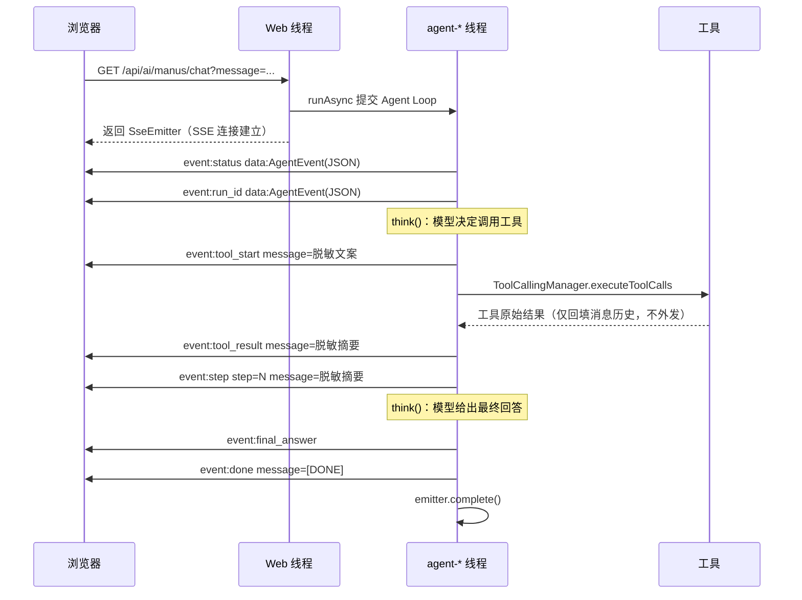

# 03 - 统一 SSE 事件协议与 Agent 工具白名单

> 本文档与当前代码库完全一致，面向已有 Java / Spring Boot 基础、正在学习 Agent 工程化的开发者。
> 所有类名、方法名、代码片段均来自本项目真实实现，无伪代码。
> 前置阅读：[02 - Agent 状态机与任务取消](./02-agent-state-and-task-cancel.md)

---

## 1. 本次功能目标

### 1.1 为什么纯字符串事件难维护

改造前，SSE 的 `data` 是随手拼接的字符串：

```java
sendEvent(emitter, "step", "Step " + ctx.getCurrentStep() + ": " + stepResult);
sendEvent(emitter, "done", "[DONE]");
emitter.send(SseEmitter.event().name("cancelled").data("任务已取消：" + runId));
```

| 问题 | 具体表现 |
| --- | --- |
| 前端只能"猜格式" | 想知道第几步，得对 `"Step 1: xxx"` 做字符串切割；格式一改，前端全挂 |
| 字段不统一 | 有的事件带 runId，有的不带；有的带步数，有的不带，前端要写 N 套解析分支 |
| 敏感信息外泄风险 | `stepResult` 直接拼进 data，而 `stepResult` 里曾经包含完整工具原始结果（文件绝对路径、搜索全文等） |
| 无协议约束 | 事件类型是散落在代码里的字符串字面量（`"status"`、`"tool_start"`），拼错不报编译错误 |

### 1.2 为什么不能让所有 Agent 获取所有工具

改造前，`ToolRegistryConfig` 把 6 个工具全部注册进一个 `mkToolCallbacks` 数组，任何 Agent 拿到它时就拥有全部能力：

| 风险 | 说明 |
| --- | --- |
| 模型误用高权限工具 | 模型是概率系统，提示词注入或幻觉都可能诱导它调用 `write_file`、`download_resource` 等高风险工具 |
| 攻击面扩大 | 工具定义（名称 + 描述 + 参数 Schema）会随 Prompt 发给模型；工具越多，被提示词注入利用的面越大 |
| 成本与延迟 | 每个工具定义都消耗 token，无关工具白白增加每次模型调用的开销 |
| 职责不清 | 问答型 Agent 拿着文件删除类工具，出问题时无法界定能力边界 |

正确做法是**最小权限原则（Least Privilege）**：每个 Agent 只拿到完成自身职责所必需的工具白名单。

### 1.3 本次目标

1. **统一事件 DTO**：所有 SSE `data` 使用 `AgentEvent`（runId / type / message / step / timestamp）；
2. **事件类型常量化**：`AgentEventType` 枚举，event name 与 `type` 字段一一对应；
3. **工具事件正式化**：`tool_start` / `tool_result` 不再是调试开关控制的调试事件，而是协议内事件，消息经 `ToolEventMessageProvider` 脱敏；
4. **工具白名单**：`AgentType` + `AgentToolProvider`，按 CHAT / MANUS / FILE 划分工具集合；
5. **测试保障**：白名单单测、装配集成测试、SSE 协议集成测试（含事件顺序与 JSON 反序列化）。

---

## 2. 实现前项目状态

### 2.1 已有事件与发送方式

`BaseAgent.runStream()` 当时会发送这些事件，`data` 全部是裸字符串：

| event name | data 内容（改造前） |
| --- | --- |
| `status` | `"Agent 已开始执行"` / 超时与达到预算的提示 |
| `run_id` | runId 字符串 |
| `step` | `"Step N: " + stepResult`（stepResult 含完整工具原始结果） |
| `final_answer` | 模型最终回答 |
| `error` | `"智能体执行失败，请稍后重试。"` |
| `done` | `"[DONE]"` |
| `tool_start` / `tool_result` | 调试事件，默认关闭（`agent.debug-sse-events=true` 才发送） |
| `cancelled` | `"任务已取消：" + runId`（由 AiController 取消接口发送） |

### 2.2 原有工具注册方式及其风险

```java
// 改造前的 ToolRegistryConfig（节选）
@Bean("mkToolCallbacks")
public ToolCallback[] mkToolCallbacks(...) {
    List<Object> tools = new ArrayList<>();
    tools.add(webSearchTool);
    tools.add(pdfGenerationTool);
    tools.add(fileOperationTool);      // 文件读写：高风险
    tools.add(resourceDownloadTool);   // 资源下载：高风险
    tools.add(webScrapingTool);
    tools.add(terminateTool);
    return ToolCallbacks.from(tools.toArray());
}
```

风险：MkManus 作为一个"搜索 + 总结"型 Agent，却持有文件写入、资源下载能力；一旦模型被网页内容中的提示词注入诱导，就可能执行文件操作。

---

## 3. 核心概念

### 3.1 SSE 的 event name 与 data

一条 SSE 消息由若干字段组成，本项目用到两个：

```text
event:tool_start
data:{"runId":"...","type":"tool_start","message":"正在查询库存信息","step":1,"timestamp":1787580101172}

```

- `event`：事件名。浏览器 `EventSource` 的 `onmessage` **只会收到没有 event 字段（或 event 为 message）的事件**；命名事件必须用 `addEventListener("tool_start", ...)` 监听；
- `data`：负载内容。`SseEmitter.data(Object)` 会交给 Jackson 序列化成单行 JSON。

本项目采用"**双保险**"设计：event name 与 data 里的 `type` 字段保持一致。前端既可以用命名事件精确监听，也可以在 `onmessage` 里解析 `type` 做兜底分发。

### 3.2 AgentEvent DTO

真实代码见 [AgentEvent](file:///D:/mk-agent/src/main/java/com/example/mkagent/model/AgentEvent.java)：

```java
public class AgentEvent {
    private String runId;     // 所属任务唯一标识
    private String type;      // 与 SSE event name 一致
    private String message;   // 用户可理解、经过脱敏的文本
    private Integer step;     // 事件发生时的 Agent Loop 步数
    private long timestamp;   // 毫秒时间戳

    public static AgentEvent of(String runId, AgentEventType type,
                                String message, Integer step) {
        return new AgentEvent(runId, type, message, step);
    }
}
```

安全约束：`message` 禁止包含 API Key、Cookie、SQL、系统提示词、异常堆栈、文件绝对路径、完整敏感工具结果。

### 3.3 AgentEventType：事件类型常量化

真实代码见 [AgentEventType](file:///D:/mk-agent/src/main/java/com/example/mkagent/model/AgentEventType.java)。`wireName()` 返回协议名（snake_case），避免字符串字面量散落各处：

```java
public enum AgentEventType {
    RUN_ID("run_id"), STATUS("status"), STEP("step"),
    TOOL_START("tool_start"), TOOL_RESULT("tool_result"),
    FINAL_ANSWER("final_answer"), ERROR("error"),
    DONE("done"), CANCELLED("cancelled");
    // ...
}
```

### 3.4 ToolCallback 与工具白名单

- `ToolCallback`：Spring AI 中"一个可被模型调用的工具"的抽象，包含工具定义（名称 / 描述 / 参数 Schema）与执行入口。`ToolCallbacks.from(Object...)` 会把带 `@Tool` 注解方法的对象批量转换为 `ToolCallback[]`（一个类的多个 `@Tool` 方法会展开成多个 callback，例如 `FileOperationTool` 展开为 `read_file` 与 `write_file` 两个）；
- **工具白名单**：`AgentToolProvider` 维护 `AgentType → 工具 Bean 列表` 的映射，Agent 构造时只注入自己类型对应的数组。

### 3.5 最小权限原则

> 每个组件只应拥有完成其职责所必需的最小权限集合。

在 Agent 系统中的落地：

| 手段 | 本项目实现 |
| --- | --- |
| 能力分组 | `AgentType.CHAT / MANUS / FILE` 三类白名单 |
| 按需注入 | `MkManus` 只注入 `mkToolCallbacks`（MANUS 白名单） |
| 提示词对齐 | 系统提示词只描述白名单内的工具，不提及没有权限的工具 |
| 测试兜底 | 单测 + 集成测试断言各类型的工具集合严格等于白名单 |

---

## 4. 流程图

### 4.1 浏览器接收统一事件的过程



### 4.2 不同 Agent 获取不同工具的过程

```mermaid
flowchart TD
    subgraph 工具 Bean 单例
        WS[WebSearchTool]
        WSC[WebScrapingTool]
        TM[TerminateTool]
        FO[FileOperationTool]
        RD[ResourceDownloadTool]
        PDF[PDFGenerationTool]
    end

    ATP[AgentToolProvider<br/>AgentType → 工具列表映射]

    WS --> ATP
    WSC --> ATP
    TM --> ATP
    FO --> ATP
    RD --> ATP
    PDF --> ATP

    ATP -->|CHAT: web_search| CB[chatToolCallbacks Bean]
    ATP -->|MANUS: web_search + web_scrape + terminate_task| MB[mkToolCallbacks Bean]
    ATP -->|FILE: read_file + write_file + download_resource + generate_pdf| FB[fileToolCallbacks Bean]

    MB -->|@Qualifier 注入| MK[MkManus]
    CB -.预留.-> CA[未来的 CHAT Agent]
    FB -.预留.-> FA[未来的 FILE Agent]
```

---

## 5. 文件变更表格

| 文件 | 变更类型 | 说明 |
| --- | --- | --- |
| [AgentEvent.java](file:///D:/mk-agent/src/main/java/com/example/mkagent/model/AgentEvent.java) | 新增 | 统一 SSE 事件 DTO（runId / type / message / step / timestamp） |
| [AgentEventType.java](file:///D:/mk-agent/src/main/java/com/example/mkagent/model/AgentEventType.java) | 新增 | 事件类型枚举，`wireName()` 即 SSE event name |
| [AgentType.java](file:///D:/mk-agent/src/main/java/com/example/mkagent/model/AgentType.java) | 新增 | Agent 类型枚举：CHAT / MANUS / FILE |
| [AgentToolProvider.java](file:///D:/mk-agent/src/main/java/com/example/mkagent/config/AgentToolProvider.java) | 新增 | 按 Agent 类型提供工具白名单 |
| [ToolEventMessageProvider.java](file:///D:/mk-agent/src/main/java/com/example/mkagent/tools/ToolEventMessageProvider.java) | 新增 | 工具事件脱敏消息接口 |
| [DefaultToolEventMessageProvider.java](file:///D:/mk-agent/src/main/java/com/example/mkagent/tools/DefaultToolEventMessageProvider.java) | 新增 | 默认实现：已知工具的用户可读文案 + 兜底文案 |
| [BaseAgent.java](file:///D:/mk-agent/src/main/java/com/example/mkagent/agent/BaseAgent.java) | 修改 | `sendEvent` 改为发送 `AgentEvent`；移除 `debugSseEvents` 开关与 `sendDebugEvent` |
| [ToolCallAgent.java](file:///D:/mk-agent/src/main/java/com/example/mkagent/agent/ToolCallAgent.java) | 修改 | 发送脱敏的 `tool_start` / `tool_result`；`act()` 摘要改为脱敏文案；新增 `getAvailableTools()` |
| [MkManus.java](file:///D:/mk-agent/src/main/java/com/example/mkagent/agent/MkManus.java) | 修改 | 注入 `ToolEventMessageProvider`；移除调试配置；系统提示词与 MANUS 白名单对齐（不再提 generate_pdf） |
| [ToolRegistryConfig.java](file:///D:/mk-agent/src/main/java/com/example/mkagent/config/ToolRegistryConfig.java) | 修改 | 拆分为 `chatToolCallbacks` / `mkToolCallbacks` / `fileToolCallbacks` 三个白名单 Bean |
| [AiController.java](file:///D:/mk-agent/src/main/java/com/example/mkagent/controller/AiController.java) | 修改 | 取消接口的 `cancelled` 事件改用 `AgentEvent` DTO |
| [MkManusAsyncSseIntegrationTest.java](file:///D:/mk-agent/src/test/java/com/example/mkagent/agent/MkManusAsyncSseIntegrationTest.java) | 修改 | 适配新协议；新增事件顺序校验、全量 data 反序列化校验 |
| [MkManusTest.java](file:///D:/mk-agent/src/test/java/com/example/mkagent/agent/MkManusTest.java) | 修改 | MANUS 白名单不再含 generate_pdf，任务场景改为搜索类 |
| [FakeChatModel.java](file:///D:/mk-agent/src/test/java/com/example/mkagent/support/FakeChatModel.java) | 修改 | 轮数计数按会话重置，支持同一实例被多个测试方法复用 |
| [AgentEventTest.java](file:///D:/mk-agent/src/test/java/com/example/mkagent/model/AgentEventTest.java) | 新增 | DTO 序列化 / 反序列化单测 |
| [AgentToolWhitelistTest.java](file:///D:/mk-agent/src/test/java/com/example/mkagent/config/AgentToolWhitelistTest.java) | 新增 | 三类白名单内容的单元测试 |
| [AgentToolWhitelistIntegrationTest.java](file:///D:/mk-agent/src/test/java/com/example/mkagent/agent/AgentToolWhitelistIntegrationTest.java) | 新增 | 生产装配集成测试：MkManus 与各白名单 Bean 的实际工具集合 |

---

## 6. 关键代码讲解

### 6.1 sendEvent：唯一的 SSE 发送出口

[BaseAgent](file:///D:/mk-agent/src/main/java/com/example/mkagent/agent/BaseAgent.java) 现在有两个发送入口，全部走统一 DTO：

```java
public void sendEvent(SseEmitter emitter, AgentEvent event) {
    try {
        emitter.send(
                SseEmitter.event()
                        .name(event.getType())   // event name 与 data.type 一致
                        .data(event)             // Jackson 序列化为单行 JSON
        );
    } catch (IOException e) {
        // 客户端已断开：发送失败是正常场景，不影响任务主流程。
        log.warn("SSE 事件发送失败（连接可能已断开）：event={}", event.getType());
    } catch (IllegalStateException e) {
        // emitter 已被 complete（例如取消接口已关闭连接），跳过本次发送。
        log.debug("SSE emitter 已关闭，跳过事件：event={}", event.getType());
    }
}

protected void sendEvent(AgentRunContext ctx, AgentEventType type, String message) {
    SseEmitter emitter = ctx.getEmitter();
    if (emitter == null) {
        return;   // 同步 run() 没有 SSE 连接，空操作
    }
    sendEvent(emitter, AgentEvent.of(
            ctx.getRunId().toString(), type, message, ctx.getCurrentStep()));
}
```

要点：

1. `name(event.getType())` 保证 event name 与 DTO 的 `type` 永远一致，不会有人手写错字符串；
2. `ctx` 版本的发送器自动填充 runId 与当前步数，调用方只关心"发什么类型的什么消息"；
3. 两类异常都被吞掉：SSE 发送失败不能影响 Agent 主流程。

### 6.2 tool_start / tool_result：脱敏工具事件

[ToolCallAgent.act()](file:///D:/mk-agent/src/main/java/com/example/mkagent/agent/ToolCallAgent.java) 的关键片段：

```java
// tool_start：工具执行前发送，不带参数、不带原始结果
response.getResult().getOutput().getToolCalls().forEach(toolCall ->
        sendEvent(ctx, AgentEventType.TOOL_START,
                toolEventMessageProvider.startMessage(toolCall.name()))
);

ToolExecutionResult executionResult =
        toolCallingManager.executeToolCalls(prompt, response);

// ... 校验最后一条消息是 ToolResponseMessage 后：

// tool_result：工具执行完成后发送
// 原始结果只用于推导摘要（如结果条数），绝不外发
toolResponseMessage.getResponses().forEach(responseItem ->
        sendEvent(ctx, AgentEventType.TOOL_RESULT,
                toolEventMessageProvider.resultMessage(
                        responseItem.name(),
                        responseItem.responseData()))
);
```

`act()` 的返回值（会进入 `step` 事件的 message）同样换成了脱敏摘要：

```java
return toolResponseMessage.getResponses()
        .stream()
        .map(responseItem -> toolEventMessageProvider.resultMessage(
                responseItem.name(), responseItem.responseData()))
        .collect(Collectors.joining("\n"));
```

改造前这里返回的是 `"工具 xxx 执行完成：" + 完整原始结果`，会把文件绝对路径等敏感信息直接推进 SSE。

### 6.3 ToolEventMessageProvider：脱敏文案从哪来

[DefaultToolEventMessageProvider](file:///D:/mk-agent/src/main/java/com/example/mkagent/tools/DefaultToolEventMessageProvider.java) 维护两张映射表 + 兜底逻辑：

```java
private static final Map<String, String> START_MESSAGES = Map.of(
        "web_search", "正在搜索互联网公开资料",
        "web_scrape", "正在抓取网页正文",
        "read_file", "正在读取文件内容",
        // ...
        "demo_inventory_check", "正在查询库存信息"
);

// web_search 的结果消息会根据原始结果推导条数（只暴露条数，不暴露内容）
int count = rawResult.split("\n---\n").length;
return "网页搜索完成，获取 " + count + " 条结果";
```

未登记的工具走兜底：`"正在调用工具：" + toolName` / `"工具调用完成"`。这也是测试工具 `demo_inventory_check` 无需改动生产映射之外的任何代码就能获得友好文案的原因。

### 6.4 AgentToolProvider：工具白名单工厂

[AgentToolProvider](file:///D:/mk-agent/src/main/java/com/example/mkagent/config/AgentToolProvider.java)：

```java
@Component
public class AgentToolProvider {

    private final Map<AgentType, List<Object>> toolBeansByType;

    public AgentToolProvider(WebSearchTool webSearchTool, ...) {
        this.toolBeansByType = Map.of(
                AgentType.CHAT,  List.of(webSearchTool),
                AgentType.MANUS, List.of(webSearchTool, webScrapingTool, terminateTool),
                AgentType.FILE,  List.of(fileOperationTool, resourceDownloadTool, pdfGenerationTool)
        );
    }

    public ToolCallback[] getTools(AgentType agentType) {
        List<Object> tools = toolBeansByType.get(agentType);
        if (tools == null || tools.isEmpty()) {
            throw new IllegalArgumentException("AgentType 未配置任何工具：" + agentType);
        }
        return ToolCallbacks.from(tools.toArray());
    }
}
```

[ToolRegistryConfig](file:///D:/mk-agent/src/main/java/com/example/mkagent/config/ToolRegistryConfig.java) 只负责把它暴露成三个具名 Bean：

```java
@Bean("chatToolCallbacks")
public ToolCallback[] chatToolCallbacks(AgentToolProvider toolProvider) {
    return toolProvider.getTools(AgentType.CHAT);
}

@Bean("mkToolCallbacks")
public ToolCallback[] mkToolCallbacks(AgentToolProvider toolProvider) {
    return toolProvider.getTools(AgentType.MANUS);
}

@Bean("fileToolCallbacks")
public ToolCallback[] fileToolCallbacks(AgentToolProvider toolProvider) {
    return toolProvider.getTools(AgentType.FILE);
}
```

保留 `mkToolCallbacks` 这个 Bean 名有两个原因：

1. `MkManus` 构造器继续用 `@Qualifier("mkToolCallbacks")` 注入，装配方式不变；
2. 集成测试的既有覆盖机制（`@TestConfiguration` 中同名 `@Bean("mkToolCallbacks")` + `allow-bean-definition-overriding`）无需改动，测试工具 `DemoInventoryTool` 仍然只存在于测试上下文。

---

## 7. 手撕实现步骤（从零复现）

1. **先建协议模型**
   - `model/AgentEventType.java`：枚举所有事件类型，`wireName()` 返回 snake_case 协议名；
   - `model/AgentEvent.java`：无参构造器（Jackson 反序列化必需）+ 私有全参构造 + 静态工厂 `of(...)`（自动填 type 与 timestamp）。

2. **改造发送出口**
   - `BaseAgent.sendEvent(SseEmitter, AgentEvent)`：`name(event.getType()).data(event)`，吞掉 `IOException`（客户端断开）与 `IllegalStateException`（emitter 已关闭）；
   - `BaseAgent.sendEvent(AgentRunContext, AgentEventType, String)`：从 ctx 自动填 runId / step；
   - 删除旧的 `sendEvent(emitter, String, String)` 与调试开关 `debugSseEvents` / `sendDebugEvent`。

3. **逐个替换 runStream 内的发送点**
   - status / run_id / step / final_answer / done / error 全部改为 `AgentEvent`；
   - 注意：`step` 事件不再拼 `"Step N: "` 前缀，步数放在 DTO 的 `step` 字段。

4. **工具事件脱敏**
   - 新建 `ToolEventMessageProvider` 接口与 `DefaultToolEventMessageProvider` 实现；
   - `ToolCallAgent` 构造器新增 `ToolEventMessageProvider` 参数；
   - `act()` 中：执行前逐个发 `TOOL_START`，执行后逐个发 `TOOL_RESULT`，`act()` 返回值改为脱敏摘要。

5. **工具白名单**
   - `model/AgentType.java`：CHAT / MANUS / FILE；
   - `config/AgentToolProvider.java`：构造器注入全部工具 Bean，内部维护 `AgentType → 工具列表` 映射；
   - `config/ToolRegistryConfig.java`：改为三个白名单 Bean（保留 `mkToolCallbacks` 名称兼容现有注入与测试覆盖）；
   - `MkManus` 系统提示词同步删除白名单外工具（generate_pdf）的规则。

6. **取消接口对齐**
   - `AiController.cancelManusTask` 的 `cancelled` 事件改为发送 `AgentEvent`，并补充 `IllegalStateException` 分支。

7. **测试验证**
   - DTO 序列化单测（`AgentEventTest`）；
   - 白名单单测（`AgentToolWhitelistTest`）：直接 new 工具实例，断言三类集合；
   - 白名单装配集成测试（`AgentToolWhitelistIntegrationTest`）：不覆盖 `mkToolCallbacks`，验证生产装配；
   - SSE 协议集成测试（`MkManusAsyncSseIntegrationTest`）：事件齐全、顺序、全部 data 可反序列化、无敏感信息。

---

## 8. 事件协议表

所有事件 `data` 均为 `AgentEvent` 的 JSON：`{"runId":"...","type":"...","message":"...","step":N,"timestamp":...}`。

| event name | 用途 | message 示例 | step | 前端建议行为 |
| --- | --- | --- | --- | --- |
| `status` | 生命周期状态通知 | `Agent 已开始执行` / `任务运行超时，已强制停止。` | 当前步数（初始为 0） | 更新状态栏 / toast |
| `run_id` | 兼容旧前端推送 runId（新协议下每条事件都带 runId） | runId 本身 | 0 | 保存 runId 供取消接口使用 |
| `step` | 一轮 Agent Loop 完成的脱敏摘要 | `库存查询完成` | 当前步数 | 追加到执行过程时间线 |
| `tool_start` | 工具调用开始 | `正在搜索互联网公开资料` | 当前步数 | 显示"正在执行 XX"动画 |
| `tool_result` | 工具调用完成（摘要，非完整结果） | `网页搜索完成，获取 5 条结果` | 当前步数 | 结束对应动画，展示摘要 |
| `final_answer` | 模型最终回答 | 完整回答文本 | 当前步数 | 渲染最终结果（可走 Markdown） |
| `error` | 任务失败（脱敏提示，无堆栈） | `智能体执行失败，请稍后重试。` | 当前步数 | 错误提示 + 重试入口 |
| `done` | SSE 流正常结束标记 | `[DONE]` | 当前步数 | 关闭加载态，结束监听 |
| `cancelled` | 任务被主动取消 | `任务已取消` | 当前步数 | 展示已取消状态 |

**顺序约定**：

```text
status
  ↓
step 或 tool_start
  ↓
tool_result
  ↓
final_answer 或 error
  ↓
done
```

实现上的保证：同一次任务的所有事件都由同一个 `agent-*` 任务线程串行发送（取消接口的 `cancelled` 除外），`done` 一定在终态确定之后、`emitter.complete()` 之前发送。

---

## 9. 测试验证

### 9.1 测试命令与覆盖点

```powershell
# 本次功能的目标测试套件（全部不依赖真实模型 / 网络）
./mvnw.cmd test '-Dtest=AgentEventTest,AgentToolWhitelistTest,AgentStateMachineUnitTest,MkManusAsyncSseIntegrationTest,AgentToolWhitelistIntegrationTest,AgentTaskCancelIntegrationTest' '-DfailIfNoTests=false'
```

> PowerShell 中含逗号的参数必须加引号，否则会被解析成参数分隔符。

| 测试类 | 覆盖点 |
| --- | --- |
| `AgentEventTest` | AgentEvent JSON 双向序列化；事件类型协议名 |
| `AgentToolWhitelistTest` | CHAT 拿不到 FileOperationTool；MANUS 拿不到文件类高风险工具；FILE 只含文件类工具 |
| `AgentToolWhitelistIntegrationTest` | 生产装配下 MkManus 实际持有的工具集合；chat/file 白名单 Bean 内容 |
| `MkManusAsyncSseIntegrationTest` | 事件齐全（含 tool_start / tool_result）；事件顺序；全部 data 可反序列化为 AgentEvent；SSE 不携带完整工具原始结果；工具真实执行 |
| `AgentStateMachineUnitTest` | 回归：状态机、预算、超时、取消、cleanupOnce |
| `AgentTaskCancelIntegrationTest` | 回归：取消接口与 cancelled 事件 |

### 9.2 实际结果（2026-08-24，本机 JDK 21 + Windows）

```text
Tests run: 11, Failures: 0, Errors: 0, Skipped: 0 -- AgentStateMachineUnitTest
Tests run: 2,  Failures: 0, Errors: 0, Skipped: 0 -- AgentTaskCancelIntegrationTest
Tests run: 3,  Failures: 0, Errors: 0, Skipped: 0 -- AgentToolWhitelistIntegrationTest
Tests run: 3,  Failures: 0, Errors: 0, Skipped: 0 -- MkManusAsyncSseIntegrationTest
Tests run: 3,  Failures: 0, Errors: 0, Skipped: 0 -- AgentToolWhitelistTest
Tests run: 3,  Failures: 0, Errors: 0, Skipped: 0 -- AgentEventTest
合计：25 / 25 通过（Tests run: 25, Failures: 0, Errors: 0, Skipped: 0）
```

### 9.3 真实捕获的 SSE 原始输出（节选）

以下 `status` / `run_id` 两条为集成测试日志中真实打印的原始 SSE 文本（runId / timestamp 为当时实际值）：

```text
event:status
data:{"runId":"2389c484-5734-4c1a-a541-f43205891fa5","type":"status","message":"Agent 已开始执行","step":0,"timestamp":1787580101172}

event:run_id
data:{"runId":"2389c484-5734-4c1a-a541-f43205891fa5","type":"run_id","message":"2389c484-5734-4c1a-a541-f43205891fa5","step":0,"timestamp":1787580101173}
```

一次成功任务（FakeChatModel 两轮：先调用 `demo_inventory_check`，再基于工具结果回答）的完整事件序列如下（runId / timestamp 以实际值为准）：

```text
event:status
data:{"runId":"<uuid>","type":"status","message":"Agent 已开始执行","step":0,"timestamp":...}

event:run_id
data:{"runId":"<uuid>","type":"run_id","message":"<uuid>","step":0,"timestamp":...}

event:tool_start
data:{"runId":"<uuid>","type":"tool_start","message":"正在查询库存信息","step":1,"timestamp":...}

event:tool_result
data:{"runId":"<uuid>","type":"tool_result","message":"库存查询完成","step":1,"timestamp":...}

event:step
data:{"runId":"<uuid>","type":"step","message":"库存查询完成","step":1,"timestamp":...}

event:step
data:{"runId":"<uuid>","type":"step","message":"模型本轮未请求工具，已得到最终回答。","step":2,"timestamp":...}

event:final_answer
data:{"runId":"<uuid>","type":"final_answer","message":"SKU MK-2026-001 当前库存数量为 17，状态为可发货。","step":2,"timestamp":...}

event:done
data:{"runId":"<uuid>","type":"done","message":"[DONE]","step":2,"timestamp":...}
```

对照改造前的关键差异：

- `step` 事件不再出现 `"Step 1: 工具 xxx 执行完成：完整原始结果"`；
- SSE 流中不出现工具原始结果（`MK-2026-001 -> 库存数量：17，状态：可发货` 只存在于服务端日志与消息历史）；
- 每条 data 都能被 `ObjectMapper.readValue(data, AgentEvent.class)` 反序列化（集成测试逐条验证）。

---

## 10. 常见问题表

| 问题 | 原因 | 解决 |
| --- | --- | --- |
| 浏览器 `onmessage` 收不到命名事件 | `EventSource.onmessage` 只接收没有 `event` 字段（或为 `message`）的事件；`event:tool_start` 这类命名事件不会触发它 | 用 `es.addEventListener("tool_start", handler)` 逐个监听；或后端同时把 `type` 放进 data（本项目已做），前端在 `onmessage` 里解析 `data.type` 做兜底分发 |
| 事件顺序错乱（done 出现在 final_answer 前等） | 多个线程同时向同一 emitter 发送；或在终态确定前提前发送 done | 保证同一任务的事件由同一任务线程串行发送；`done` 必须在终态确定后、`emitter.complete()` 前发送（见 `BaseAgent.runStream`） |
| 前端反序列化失败 | data 不是合法 JSON（多行、被截断、仍是拼接字符串） | 后端统一用 `data(Object)` 交给 Jackson 输出单行 JSON；前端 `JSON.parse` 前可先判断是否以 `{` 开头；集成测试已对每条 data 做反序列化回归 |
| 模型误用高权限工具 | 工具白名单太宽；系统提示词提及了 Agent 没有权限的工具 | 按 `AgentType` 收紧白名单；系统提示词只描述白名单内工具；用集成测试断言 Agent 实际持有的工具集合 |
| 工具结果泄露敏感信息（路径 / 密钥） | 把工具原始结果直接拼进事件 message | 事件 message 一律经过 `ToolEventMessageProvider` 脱敏；原始结果只回填消息历史与服务端日志；集成测试断言 SSE 不含原始结果特征串 |
| 取消后前端没收到 `cancelled` 事件 | emitter 已被 complete 或客户端已断开 | 发送时捕获 `IOException` 与 `IllegalStateException`；取消语义以取消接口返回的 `state: CANCELLED` 为准 |
| 新增工具后前端文案变成"正在调用工具：xxx" | `DefaultToolEventMessageProvider` 未登记新工具，走了兜底文案 | 在 `START_MESSAGES` / `RESULT_MESSAGES` 中补充新工具的用户可读文案 |
| 测试里覆盖 `mkToolCallbacks` 不生效 | 未开启 Bean 定义覆盖 | 测试属性加 `spring.main.allow-bean-definition-overriding=true`，并用同名 `@Bean("mkToolCallbacks")` |

---

## 11. 面试题

1. **SSE 中 `event` 字段和 `data` 字段分别起什么作用？为什么浏览器 `EventSource.onmessage` 收不到命名事件？你会如何设计协议兼容两种监听方式？**
   参考要点：命名事件只被 `addEventListener` 捕获；把事件类型同时写进 data 的 `type` 字段（本项目的双保险设计）。
2. **为什么 Agent 的 SSE 事件要用统一 DTO 而不是拼接字符串？统一 DTO 对前后端协作、测试、安全各有什么好处？**
   参考要点：结构化契约、可反序列化回归测试、字段级脱敏约束。
3. **什么是工具调用的最小权限原则？如果让所有 Agent 共享全部工具，会出现哪些具体风险？**
   参考要点：提示词注入诱导高风险工具、幻觉误用、攻击面与 token 成本、职责边界。
4. **Spring AI 中 `ToolCallback`、`ToolCallbacks.from(...)`、`ToolCallbackProvider` 分别是什么？一个含多个 `@Tool` 方法的类会被转换成几个 ToolCallback？**
   参考要点：每个 `@Tool` 方法一个 callback（如 `FileOperationTool` → `read_file` + `write_file`）。
5. **如何在保证"测试可用确定性假工具"的同时，不污染生产工具注册？本项目的机制是什么？**
   参考要点：测试工具放 src/test、`@TestConfiguration` 同名 Bean 覆盖 + `allow-bean-definition-overriding`。
6. **异步场景下如何保证 SSE 事件顺序？`SseEmitter.send` 在客户端断开或已关闭时会抛什么异常，应该怎么处理？**
   参考要点：单任务线程串行发送；`IOException` / `IllegalStateException` 吞掉不影响主流程。
7. **tool_result 事件为什么不能直接把工具原始结果发给前端？你会怎么设计摘要？**
   参考要点：原始结果可能含路径 / 密钥 / 注入内容；按工具名映射文案 + 从原始结果推导统计量（条数）。
8. **如何验证"工具白名单真的生效了"，而不只是配置写对了？本项目分了哪两层测试？**
   参考要点：白名单内容单测（Provider 层）+ Spring 上下文装配集成测试（Agent 实际持有工具）。

---

## 12. 后续优化方向

| 方向 | 说明 |
| --- | --- |
| 按用户权限 / 租户控制工具 | 白名单从"按 Agent 类型"升级为"按租户 / 角色 ∩ Agent 类型"，在 `getTools` 时叠加用户维度过滤 |
| 工具审批（Human-in-the-loop） | 高风险工具（写文件 / 下载）执行前先推送 `tool_approval_request` 事件，等用户确认后再执行 |
| 工具参数校验 | 在 `ToolCallingManager` 执行前校验参数（白名单域名、文件名规则、长度上限），拒绝非法参数并回写安全的错误结果 |
| 工具调用审计持久化 | 将 tool_start / tool_result（含 runId、工具名、耗时、参数哈希）落库，支持事后审计与回放 |
| 事件文案外置 | `ToolEventMessageProvider` 的文案改为配置化 / 多语言，运营可改不发布 |
| 流式最终回答 | `final_answer` 拆成多个 `answer_delta` 增量事件，配合模型流式输出，前端打字机效果 |
| 分布式任务注册表 | `AgentTaskRegistry` 换成 Redis，支持多实例部署下跨节点取消 |
