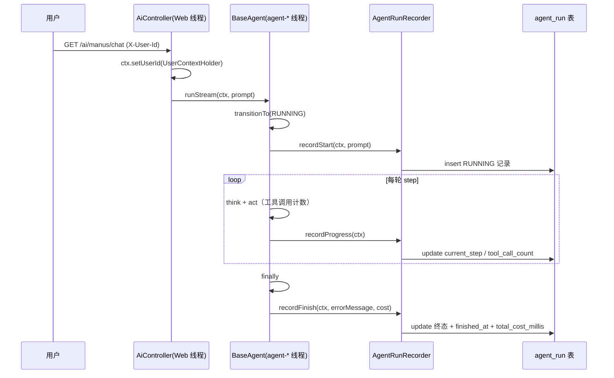
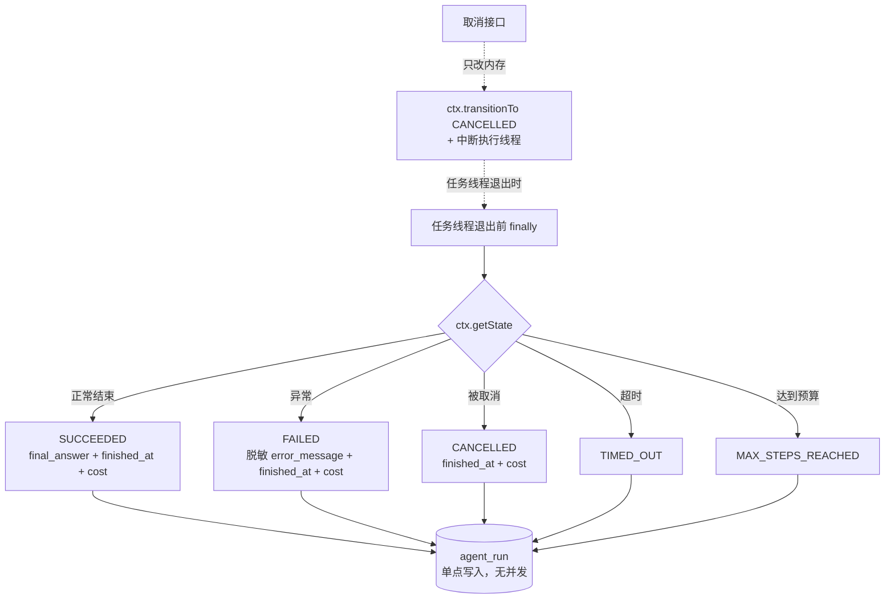
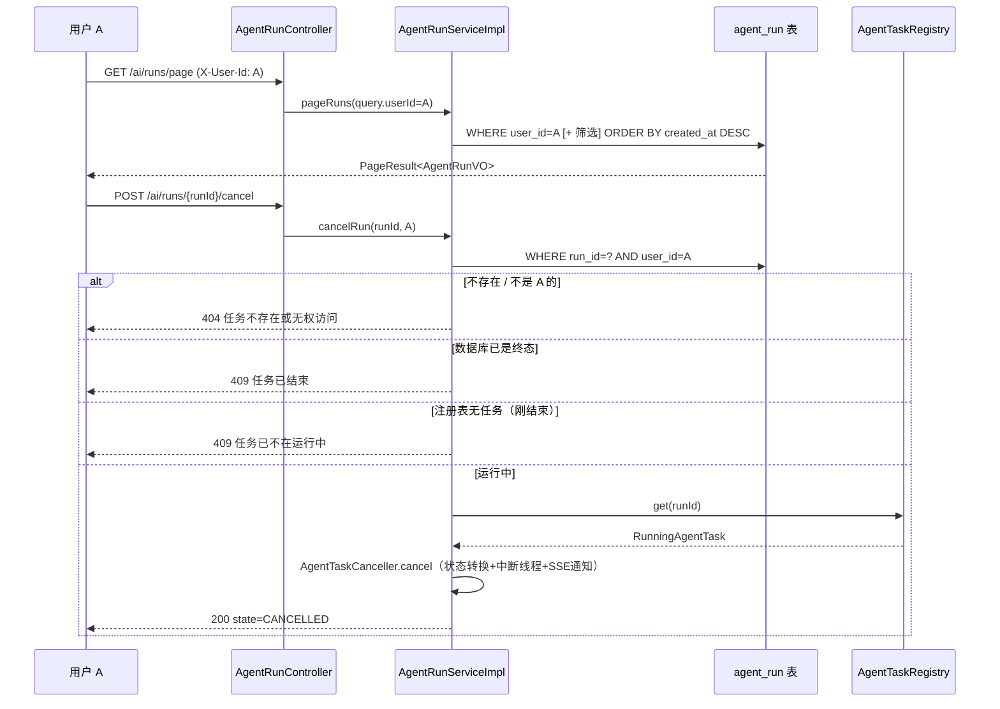

# 04 - AgentRun 任务持久化与历史查询

> 本文档与当前代码库完全一致，面向已有 Java / Spring Boot 基础、正在学习 Agent 工程化的开发者。
> 所有类名、方法名、代码片段均来自本项目真实实现，无伪代码。
> 前置阅读：[03 - 统一 SSE 事件协议与 Agent 工具白名单](./03-sse-event-protocol-and-tool-whitelist.md)

---

## 1. 本次功能目标

### 1.1 为什么仅靠内存上下文不够

改造前，一个任务的全部运行信息只存在于两个内存对象里：`AgentRunContext`（任务上下文）与 `AgentTaskRegistry`（运行中任务注册表）。只要进程内存还在，它们就够用；但以下场景全部无解：

| 场景 | 内存方案的问题 |
| --- | --- |
| 用户刷新页面 / 关闭浏览器 | SSE 连接断开后，前端再也拿不到任务进度和最终答案；任务其实还在后台跑 |
| 历史查询 | "我昨天跑过哪些任务？哪个失败了？耗时多少？"——进程重启或任务结束后内存里什么都没有 |
| 故障排查 | 任务失败原因只打进了日志，无法按用户、按时间、按状态检索 |
| 多实例部署的前置条件 | 任务状态只在单机内存，任何"跨机器查任务"都无从谈起 |

### 1.2 本次目标

1. **agent_run 表**：把任务生命周期（开始 / 进度 / 终态）持久化到 PostgreSQL；
2. **生命周期接入**：`BaseAgent` 在任务开始、每轮 step 结束、任务终态三个时机写库；
3. **失败隔离**：数据库写失败只记日志，绝不中断 Agent 主流程；
4. **三个接口**：`GET /ai/runs/{runId}`、`GET /ai/runs/page`、`POST /ai/runs/{runId}/cancel`；
5. **权限隔离**：用户只能访问自己的任务（`X-User-Id` 请求头占位方案）；
6. **内外分工**：`AgentTaskRegistry` 继续负责实时取消，数据库负责历史与状态查询。

---

## 2. 实现前项目状态

### 2.1 AgentTaskRegistry 能解决什么、不能解决什么

真实代码见 [AgentTaskRegistry](file:///D:/mk-agent/src/main/java/com/example/mkagent/agent/AgentTaskRegistry.java)：

| 能力 | 能 / 不能 | 原因 |
| --- | --- | --- |
| 实时取消运行中任务 | ✅ | 持有 `CompletableFuture` 与执行线程引用，可中断 |
| 判断任务是否还在跑 | ✅ | `ConcurrentHashMap` 按 runId 实时注册 / 移除 |
| 查询已结束的任务 | ❌ | 任务结束即从注册表移除，信息丢失 |
| 进程重启后恢复记录 | ❌ | 纯内存结构，重启即清空 |
| 按用户 / 状态 / 时间筛选 | ❌ | 没有存储层，无法建索引 |

### 2.2 AgentRunContext 能解决什么、不能解决什么

真实代码见 [AgentRunContext](file:///D:/mk-agent/src/main/java/com/example/mkagent/model/AgentRunContext.java)：

| 能力 | 能 / 不能 | 原因 |
| --- | --- | --- |
| 承载单次运行的全部运行时状态 | ✅ | runId / state / currentStep / toolCallCount / finalAnswer 都在 |
| 跨线程传递（Web 线程 → agent-* 线程） | ✅ | 任务提交前构造，随 lambda 捕获 |
| 任务结束后仍可访问 | ⚠️ 有限 | 只有注册表持有引用时活着，任务移除后随之失联 |
| 供外部按 runId 检索 | ❌ | 没有全局索引，外部拿不到 ctx 对象 |

**结论**：内存方案解决"正在跑"，数据库方案解决"跑过什么"。两者互补，缺一不可——取消必须走内存（实时），历史必须走数据库（持久）。

---

## 3. 核心概念

### 3.1 Entity / DTO / VO 分层

| 层 | 本项目对象 | 职责 |
| --- | --- | --- |
| Entity | [AgentRunEntity](file:///D:/mk-agent/src/main/java/com/example/mkagent/entity/AgentRunEntity.java) | 与 `agent_run` 表一一对应，`@TableName` / `@TableId` 标注，只用于持久层 |
| DTO | [AgentRunQueryDTO](file:///D:/mk-agent/src/main/java/com/example/mkagent/model/dto/AgentRunQueryDTO.java) | 查询入参（分页 + 筛选条件），`userId` 由服务端填充，不接受客户端传入 |
| VO | [AgentRunVO](file:///D:/mk-agent/src/main/java/com/example/mkagent/model/vo/AgentRunVO.java) | 接口出参，只读字段，`fromEntity()` 静态转换；分页用 [PageResult](file:///D:/mk-agent/src/main/java/com/example/mkagent/model/vo/PageResult.java) 包装 |

原则：**Entity 不出 Controller**。直接暴露 Entity 会让表结构变更直接传导给前端，还可能带出不应展示的字段。

### 3.2 runId：业务键与数据库主键分离

- `id`：数据库主键，MyBatis-Plus `IdType.ASSIGN_ID`（雪花）生成，不依赖数据库自增；
- `run_id`：业务唯一键，由 `AgentRunContext` 构造时生成的 UUID，唯一索引。

分离的好处：业务键在任务创建瞬间就确定（前端立刻可用），与数据库行何时插入无关；换库 / 分表也不影响对外标识。

### 3.3 异步状态同步：内存状态是唯一事实源

任务状态先在内存里流转（`AgentState` 状态机），再由 `AgentRunRecorder` 在三个时机"抄"进数据库：

```text
ctx.transitionTo(RUNNING)  ──recordStart──▶   DB insert RUNNING
每轮 step 结束            ──recordProgress──▶ DB update current_step / tool_call_count
finally（任务线程）        ──recordFinish──▶   DB update 终态 + finished_at + total_cost_millis
```

方向永远是**内存 → 数据库**，反向不成立。数据库只是内存状态的异步投影。

### 3.4 最终一致性

数据库状态可能短暂落后于真实状态（写库是旁路动作，且存在延迟），所以：

- **取消接口**不信任数据库的 "RUNNING"：先做归属校验，再查 `AgentTaskRegistry`，注册表里没有任务就说明刚结束，返回 409；
- **终态单点写入**：只有任务线程的 `finally` 写终态，取消接口本身不写库，避免两个线程并发写同一行。

### 3.5 数据库索引

| 索引 | 类型 | 服务的查询 |
| --- | --- | --- |
| `uk_agent_run_run_id` | 唯一 | 按 runId 查详情 / 取消时归属校验 |
| `idx_agent_run_user_id` | 普通 | "我的任务"分页 |
| `idx_agent_run_state` | 普通 | 按状态筛选 |
| `idx_agent_run_created_at` | 普通 | 时间范围筛选 + 默认排序 |

---

## 4. 流程图

### 4.1 任务创建与步骤更新



### 4.2 成功 / 失败 / 取消的终态更新



### 4.3 用户查询与取消任务



---

## 5. 数据库表结构

真实脚本见 [schema.sql](file:///D:/mk-agent/src/main/resources/db/schema.sql)，由 `spring.sql.init`（`mode: always`）在应用启动时执行，全部语句幂等：

```sql
CREATE TABLE IF NOT EXISTS agent_run
(
    id                BIGINT       NOT NULL,
    run_id            VARCHAR(64)  NOT NULL,
    user_id           VARCHAR(64)  NOT NULL,
    agent_type        VARCHAR(32)  NOT NULL,
    user_prompt       TEXT,
    state             VARCHAR(32)  NOT NULL,
    current_step      INT          NOT NULL DEFAULT 0,
    tool_call_count   INT          NOT NULL DEFAULT 0,
    final_answer      TEXT,
    error_message     TEXT,
    started_at        TIMESTAMP,
    finished_at       TIMESTAMP,
    total_cost_millis BIGINT,
    created_at        TIMESTAMP    NOT NULL DEFAULT CURRENT_TIMESTAMP,
    updated_at        TIMESTAMP    NOT NULL DEFAULT CURRENT_TIMESTAMP,
    CONSTRAINT pk_agent_run PRIMARY KEY (id)
);

CREATE UNIQUE INDEX IF NOT EXISTS uk_agent_run_run_id ON agent_run (run_id);
CREATE INDEX IF NOT EXISTS idx_agent_run_user_id ON agent_run (user_id);
CREATE INDEX IF NOT EXISTS idx_agent_run_state ON agent_run (state);
CREATE INDEX IF NOT EXISTS idx_agent_run_created_at ON agent_run (created_at);
```

| 字段 | 说明 | 安全约束 |
| --- | --- | --- |
| `id` | 雪花主键，MP `ASSIGN_ID` 生成 | — |
| `run_id` | 业务唯一键（UUID），唯一索引 | — |
| `user_id` | 任务归属，来自请求头 `X-User-Id`（占位方案） | 查询一律强制带该条件 |
| `agent_type` | CHAT / MANUS / FILE | — |
| `user_prompt` | 用户输入，截断 4000 字符 | **不保存系统提示词** |
| `state` | 与 `AgentState` 枚举名一致 | — |
| `current_step` / `tool_call_count` | 进度指标，每轮 step 更新 | — |
| `final_answer` | 最终回答，截断 20000 字符 | — |
| `error_message` | 脱敏异常摘要（异常类型 + 消息，无堆栈），截断 2000 字符 | **不含堆栈 / 敏感信息** |
| `started_at` / `finished_at` / `total_cost_millis` | 起止时间与总耗时 | — |
| `created_at` / `updated_at` | 记录创建 / 最后更新时间 | — |

---

## 6. 文件变更表格

### 6.1 新增文件

| 文件 | 作用 |
| --- | --- |
| [schema.sql](file:///D:/mk-agent/src/main/resources/db/schema.sql) | agent_run 建表 + 索引（幂等） |
| [AgentRunEntity.java](file:///D:/mk-agent/src/main/java/com/example/mkagent/entity/AgentRunEntity.java) | 表实体（15 字段，手写 getter/setter，遵循项目零 Lombok 风格） |
| [AgentRunMapper.java](file:///D:/mk-agent/src/main/java/com/example/mkagent/mapper/AgentRunMapper.java) | MyBatis-Plus `BaseMapper` |
| [AgentRunService.java](file:///D:/mk-agent/src/main/java/com/example/mkagent/service/AgentRunService.java) | 服务接口：查详情 / 分页 / 取消 |
| [AgentRunServiceImpl.java](file:///D:/mk-agent/src/main/java/com/example/mkagent/service/impl/AgentRunServiceImpl.java) | 服务实现：权限校验 + 分页 + 取消编排 |
| [AgentRunRecorder.java](file:///D:/mk-agent/src/main/java/com/example/mkagent/service/AgentRunRecorder.java) | 生命周期记录器（start / progress / finish，失败只记日志） |
| [AgentTaskCanceller.java](file:///D:/mk-agent/src/main/java/com/example/mkagent/agent/AgentTaskCanceller.java) | 从 AiController 抽取的取消逻辑，新旧取消接口共用 |
| [AgentRunController.java](file:///D:/mk-agent/src/main/java/com/example/mkagent/controller/AgentRunController.java) | `/ai/runs` 三个接口 |
| [AgentRunQueryDTO.java](file:///D:/mk-agent/src/main/java/com/example/mkagent/model/dto/AgentRunQueryDTO.java) | 分页查询入参 |
| [AgentRunVO.java](file:///D:/mk-agent/src/main/java/com/example/mkagent/model/vo/AgentRunVO.java) | 任务详情出参 |
| [PageResult.java](file:///D:/mk-agent/src/main/java/com/example/mkagent/model/vo/PageResult.java) | 通用分页出参 |
| [UserContextHolder.java](file:///D:/mk-agent/src/main/java/com/example/mkagent/context/UserContextHolder.java) | ThreadLocal 用户上下文（X-User-Id 占位） |
| [UserContextInterceptor.java](file:///D:/mk-agent/src/main/java/com/example/mkagent/context/UserContextInterceptor.java) | 解析请求头写入 ThreadLocal，请求结束清理 |
| [WebMvcConfig.java](file:///D:/mk-agent/src/main/java/com/example/mkagent/config/WebMvcConfig.java) | 注册拦截器 |
| [MybatisPlusConfig.java](file:///D:/mk-agent/src/main/java/com/example/mkagent/config/MybatisPlusConfig.java) | 分页插件（PostgreSQL 方言） |
| [AgentRunPersistenceIntegrationTest.java](file:///D:/mk-agent/src/test/java/com/example/mkagent/agent/AgentRunPersistenceIntegrationTest.java) | 持久化 + 权限集成测试（5 个场景，H2 内存库） |

### 6.2 修改文件

| 文件 | 变更 |
| --- | --- |
| [pom.xml](file:///D:/mk-agent/pom.xml) | 新增 `mybatis-plus-spring-boot3-starter` 3.5.7、`postgresql`（runtime）、`h2`（test） |
| [application.yml](file:///D:/mk-agent/src/main/resources/application.yml) | `spring.sql.init` 启动时执行 schema.sql |
| [MkAgentApplication.java](file:///D:/mk-agent/src/main/java/com/example/mkagent/MkAgentApplication.java) | `@MapperScan("com.example.mkagent.mapper")` |
| [AgentRunContext.java](file:///D:/mk-agent/src/main/java/com/example/mkagent/model/AgentRunContext.java) | 新增 `userId` / `agentType` 字段（跨线程固化） |
| [BaseAgent.java](file:///D:/mk-agent/src/main/java/com/example/mkagent/agent/BaseAgent.java) | 生命周期持久化钩子（见第 7 节） |
| [MkManus.java](file:///D:/mk-agent/src/main/java/com/example/mkagent/agent/MkManus.java) | 注入 `AgentRunRecorder`，重写 `getAgentType()` 返回 MANUS |
| [AiController.java](file:///D:/mk-agent/src/main/java/com/example/mkagent/controller/AiController.java) | 取消逻辑改用 `AgentTaskCanceller`；发起任务前 `requireUserId()` |
| [PgVectorVectorStoreConfig.java](file:///D:/mk-agent/src/main/java/com/example/mkagent/rag/PgVectorVectorStoreConfig.java) | 增加 `mkagent.rag.pgvector.enabled` 开关（默认 true），H2 测试可禁用 |
| [FakeChatModel.java](file:///D:/mk-agent/src/test/java/com/example/mkagent/support/FakeChatModel.java) | 新增 `pauseBeforeFinalAnswer` 闸门与 `failMode`，制造可控的"运行中窗口"与失败场景 |
| 既有隔离集成测试 ×3 + MkManusTest | 数据源切 H2 后补 `mkagent.rag.pgvector.enabled=false`，HTTP 请求补 `X-User-Id` 头 |

---

## 7. 核心代码讲解

### 7.1 创建任务：recordStart

[AgentRunRecorder](file:///D:/mk-agent/src/main/java/com/example/mkagent/service/AgentRunRecorder.java) 是唯一的写库入口，`recordStart` 在任务开始（`transitionTo(RUNNING)` 之后）执行一次：

```java
public void recordStart(AgentRunContext ctx, String userPrompt) {
    try {
        LocalDateTime now = LocalDateTime.now();

        AgentRunEntity entity = new AgentRunEntity();
        entity.setRunId(ctx.getRunId().toString());
        entity.setUserId(ctx.getUserId());
        entity.setAgentType(agentTypeName(ctx.getAgentType()));
        entity.setUserPrompt(truncate(userPrompt, MAX_PROMPT_LENGTH));
        entity.setState(ctx.getState().name());
        entity.setCurrentStep(0);
        entity.setToolCallCount(0);
        entity.setStartedAt(now);
        entity.setCreatedAt(now);
        entity.setUpdatedAt(now);

        agentRunMapper.insert(entity);
    } catch (Exception e) {
        // 数据库失败绝不中断任务主流程，只记日志。
        log.error("AgentRun 创建记录持久化失败（不影响任务主流程）：runId={}",
                ctx.getRunId(), e);
    }
}
```

要点：
- **userId 跨线程问题**：`UserContextHolder` 是 ThreadLocal，Web 线程能读到，`agent-*` 线程读不到。所以 `BaseAgent.runStream()` 在 Web 线程的同步段就执行 `ctx.setUserId(UserContextHolder.getOrDefault())`，把身份固化进 ctx；
- **try-catch 包一切**：持久化是旁路动作，库挂了任务照样跑。

### 7.2 更新任务：recordProgress 与 recordFinish

进度更新只在**每轮 step 结束后**发生（`BaseAgent` 循环里 `step(ctx)` 之后），绝不在 token / chunk 级别：

```java
public void recordProgress(AgentRunContext ctx) {
    try {
        LambdaUpdateWrapper<AgentRunEntity> wrapper =
                new LambdaUpdateWrapper<AgentRunEntity>()
                        .eq(AgentRunEntity::getRunId, ctx.getRunId().toString())
                        .set(AgentRunEntity::getState, ctx.getState().name())
                        .set(AgentRunEntity::getCurrentStep, ctx.getCurrentStep())
                        .set(AgentRunEntity::getToolCallCount, ctx.getToolCallCount())
                        .set(AgentRunEntity::getUpdatedAt, LocalDateTime.now());
        agentRunMapper.update(null, wrapper);
    } catch (Exception e) { /* 只记日志 */ }
}
```

终态由任务线程在 `finally` 中**单点写入**：

```java
public void recordFinish(AgentRunContext ctx, String errorMessage, long totalCostMillis) {
    try {
        String finalAnswer = truncate(ctx.getFinalAnswer(), MAX_FINAL_ANSWER_LENGTH);
        String safeErrorMessage = truncate(errorMessage, MAX_ERROR_MESSAGE_LENGTH);

        LambdaUpdateWrapper<AgentRunEntity> wrapper =
                new LambdaUpdateWrapper<AgentRunEntity>()
                        .eq(AgentRunEntity::getRunId, ctx.getRunId().toString())
                        .set(AgentRunEntity::getState, ctx.getState().name())
                        .set(AgentRunEntity::getCurrentStep, ctx.getCurrentStep())
                        .set(AgentRunEntity::getToolCallCount, ctx.getToolCallCount())
                        .set(finalAnswer != null, AgentRunEntity::getFinalAnswer, finalAnswer)
                        .set(safeErrorMessage != null, AgentRunEntity::getErrorMessage, safeErrorMessage)
                        .set(AgentRunEntity::getFinishedAt, LocalDateTime.now())
                        .set(AgentRunEntity::getTotalCostMillis, totalCostMillis)
                        .set(AgentRunEntity::getUpdatedAt, LocalDateTime.now());
        agentRunMapper.update(null, wrapper);
    } catch (Exception e) { /* 只记日志 */ }
}
```

`errorMessage` 由 `BaseAgent.buildErrorMessage` 生成：先递归解包到根因（step 层会把真实异常包成 `RuntimeException("Agent 第 X 步执行失败")`），只取异常类型 + 消息并截断，**不落堆栈**：

```java
private String buildErrorMessage(Exception e) {
    Throwable root = e;
    while (root.getCause() != null && root.getCause() != root) {
        root = root.getCause();
    }
    String message = root.getMessage();
    String raw = root.getClass().getSimpleName()
            + (message == null ? "" : "：" + message);
    return raw.length() <= 500 ? raw : raw.substring(0, 500);
}
```

### 7.3 查询权限控制

所有查询强制带服务端解析出的 `user_id`，不由客户端传入（[AgentRunServiceImpl](file:///D:/mk-agent/src/main/java/com/example/mkagent/service/impl/AgentRunServiceImpl.java)）：

```java
private AgentRunEntity findByRunIdAndUser(String runId, String userId) {
    AgentRunEntity entity = lambdaQuery()
            .eq(AgentRunEntity::getRunId, runId)
            .eq(AgentRunEntity::getUserId, userId)
            .one();

    if (entity == null) {
        // 不存在与"存在但不是你的"统一 404，不泄露他人任务是否存在。
        throw new BusinessException(404, "任务不存在或无权访问：" + runId);
    }
    return entity;
}
```

分页同理，`userId` 是硬条件，`state` / `agentType` / 时间范围是可选筛选，`pageSize` 上限 100。

### 7.4 取消接口与内存注册表的关系

取消必须依赖内存注册表，因为数据库状态可能滞后（见 3.4）。编排逻辑在 `cancelRun`：

```java
public Map<String, Object> cancelRun(String runId, String userId) {
    AgentRunEntity entity = findByRunIdAndUser(runId, userId);   // 1. 归属校验 → 404

    if (isTerminalState(entity.getState())) {                    // 2. DB 已终态 → 409
        throw new BusinessException(409, "任务已结束，无法取消。当前状态：" + entity.getState());
    }

    RunningAgentTask task = agentTaskRegistry.get(runId);        // 3. 实时来源是注册表
    if (task == null) {
        throw new BusinessException(409, "任务已不在运行中，无法取消：" + runId);
    }

    AgentTaskCanceller.CancelResult result = agentTaskCanceller.cancel(task); // 4. 复用既有取消
    return Map.of("success", true, "runId", runId,
            "state", result.state(), "message", result.message());
}
```

`AgentTaskCanceller.cancel` 做的事（从旧接口抽取，新旧接口共用）：终态检查 → `transitionTo(CANCELLED)` → `future.cancel(true)` + `interruptExecutingThread()` → SSE 发送 `cancelled` 事件并关闭连接。**它不写库**——任务线程被中断退出后，`finally` 里的 `recordFinish` 读到 `CANCELLED` 状态自然落盘，全程只有一个写库线程。

---

## 8. 手撕实现步骤

1. **建表**：写 `db/schema.sql`（幂等 DDL），`application.yml` 配 `spring.sql.init`；
2. **依赖与配置**：pom 加 MyBatis-Plus（Spring Boot 3 starter）与驱动；启动类 `@MapperScan`；`MybatisPlusConfig` 注册分页插件；
3. **分层对象**：Entity → Mapper → DTO / VO；
4. **用户上下文**：`UserContextHolder`（ThreadLocal）+ 拦截器；接口层 `requireUserId()` 按需 401；
5. **记录器**：`AgentRunRecorder` 三个方法，全部 try-catch 只记日志，长文本截断；
6. **接入生命周期**：`BaseAgent` 在 `transitionTo(RUNNING)` 后 `recordStart`、每轮 `step()` 后 `recordProgress`、`finally` 里 `recordFinish`；recorder 走可选注入（setter），纯单测不受影响；
7. **服务与接口**：`AgentRunService`（归属校验 + 分页 + 取消编排）→ `AgentRunController`（`/ai/runs/*`）；
8. **取消复用**：把旧取消逻辑抽成 `AgentTaskCanceller`，新旧接口共用；
9. **测试**：H2（PG 兼容模式）+ `mkagent.rag.pgvector.enabled=false` 禁用 pgvector（其初始化执行 `CREATE EXTENSION IF NOT EXISTS vector`，H2 不支持）；FakeChatModel 加闸门制造运行中窗口；
10. **全量回归**。

---

## 9. API 请求 / 响应示例与测试命令

> 服务默认 `localhost:8123`，context-path `/api`。所有接口需携带 `X-User-Id` 请求头，缺失返回 401。

### 9.1 查询任务详情

```bash
curl -H "X-User-Id: user-1" http://localhost:8123/api/ai/runs/c99188d2-45dd-4cfd-8576-7b283806fa22
```

```json
{
  "id": 1959012345678901234,
  "runId": "c99188d2-45dd-4cfd-8576-7b283806fa22",
  "userId": "user-1",
  "agentType": "MANUS",
  "userPrompt": "请查询 SKU MK-2026-001 的库存...",
  "state": "SUCCEEDED",
  "currentStep": 2,
  "toolCallCount": 1,
  "finalAnswer": "SKU MK-2026-001 当前库存数量为 17，状态为可发货。",
  "errorMessage": null,
  "startedAt": "2026-08-24T23:41:07",
  "finishedAt": "2026-08-24T23:41:07",
  "totalCostMillis": 88,
  "createdAt": "2026-08-24T23:41:07",
  "updatedAt": "2026-08-24T23:41:07"
}
```

### 9.2 分页查询（支持筛选）

```bash
curl -H "X-User-Id: user-1" \
  "http://localhost:8123/api/ai/runs/page?pageNum=1&pageSize=10&state=SUCCEEDED&agentType=MANUS&startTime=2026-08-24T00:00:00&endTime=2026-08-25T00:00:00"
```

```json
{
  "pageNum": 1,
  "pageSize": 10,
  "total": 2,
  "pages": 1,
  "records": [ { "runId": "...", "state": "SUCCEEDED", "agentType": "MANUS" } ]
}
```

### 9.3 取消任务

```bash
curl -X POST -H "X-User-Id: user-1" \
  http://localhost:8123/api/ai/runs/c99188d2-45dd-4cfd-8576-7b283806fa22/cancel
```

```json
{ "success": true, "runId": "c99188d2-...", "state": "CANCELLED", "message": "任务已取消" }
```

错误响应（`GlobalExceptionHandler` 统一格式）：404 任务不存在或无权访问；409 任务已结束 / 已不在运行中；401 缺少 `X-User-Id`。

### 9.4 测试命令（PowerShell）

```powershell
# 目标套件（不触网、不依赖真实模型，H2 内存库）
./mvnw.cmd test '-Dtest=AgentRunPersistenceIntegrationTest,MkManusAsyncSseIntegrationTest,AgentTaskCancelIntegrationTest' '-DfailIfNoTests=false'

# 全量
./mvnw.cmd test
```

实测结果：`AgentTaskCancelIntegrationTest` 2/2、`MkManusAsyncSseIntegrationTest` 3/3、`AgentRunPersistenceIntegrationTest` 5/5，全量 **47/47 通过**。

---

## 10. 常见问题

| 现象 | 原因 | 处理 |
| --- | --- | --- |
| 任务已结束，数据库仍是 RUNNING | 终态写库失败（只记日志不阻断），或任务线程被 `kill -9` 没走到 finally | 查 `AgentRunRecorder` 的 error 日志；可加定时巡检：超时 RUNNING 记录标记为 FAILED/TIMED_OUT |
| 数据库更新失败 | 连接池耗尽 / 网络抖动 / 字段超长 | 记录器已兜底（try-catch + 截断）；监控日志关键字"持久化失败"，失败率高时告警而不是阻断业务 |
| 用户越权查询 | — | 查询一律服务端解析 `user_id` 强制条件下推；不存在与无权限统一 404，不泄露他人任务存在性；**永远不要信任客户端传入的 userId 参数** |
| 数据库被高频更新打爆 | 在 token / chunk 级别写库 | 本项目只在"每轮 step 结束"与"终态"写库，一次任务写库次数 = step 数 + 2；如需更细粒度，改为内存聚合 + 定时批量落盘 |
| H2 测试报 `CREATE EXTENSION` 语法错误 | `PgVectorStore` 初始化执行 PostgreSQL 专用语句 | 测试属性加 `mkagent.rag.pgvector.enabled=false`（生产默认开启，不受影响） |
| 取消接口返回 409 但数据库是 RUNNING | 任务刚好在检查间隙结束（注册表已移除，终态还没落盘） | 预期行为，稍后重查详情即可；这是最终一致性的正常窗口 |

---

## 11. 面试题

**Q1：为什么任务状态要"内存状态机为事实源、数据库为异步投影"，而不是每步都先写库再执行？**

数据库写入延迟和失败率都高于内存操作，若以数据库为事实源，库一抖任务就卡死。正确方向是内存先流转、旁路异步落库，写库失败只记日志，保证 Agent 主流程可用性优先。代价是最终一致性窗口，需用"注册表兜底实时判断"弥补。

**Q2：取消任务时，为什么不能只改数据库状态？**

数据库只是投影，改它不会让正在跑的线程停下来。实时取消必须：① 状态机转换（阻止进入下一轮）；② `future.cancel(true)` + 显式中断执行线程（线程可能阻塞在模型调用 / IO 上，`cancel` 本身不中断线程）；③ 通知 SSE 客户端。数据库的 CANCELLED 由任务线程退出时单点写入。

**Q3：runId（业务键）和 id（主键）为什么要分开？**

runId 是任务创建瞬间生成的 UUID，前端立刻可用、跨环境稳定、与存储实现解耦；id 是存储层主键（雪花），服务于数据库内部组织。合一会导致"没落库就没有标识"或"换库标识就变"。

**Q4：ThreadLocal 里的用户身份，异步任务线程为什么读不到？本项目怎么解决？**

ThreadLocal 绑定线程，`CompletableFuture.runAsync` 提交到线程池后是另一个线程，上下文自然丢失。本项目在 Web 线程的同步段（任务提交前）执行 `ctx.setUserId(UserContextHolder.getOrDefault())`，把身份固化进随 lambda 捕获的 ctx 对象——本质是"显式传参优于隐式上下文"。通用方案还有 TransmittableThreadLocal、Context Snapshot 等。

**Q5：为什么终态只允许任务线程在 finally 里写？并发写会有什么问题？**

取消接口线程和任务线程如果同时写终态，可能出现"取消写 CANCELLED 后，任务线程用旧状态 SUCCEEDED 覆盖"的丢更新问题。单点写入（只有任务线程 finally 写，取消接口只改内存状态）天然消除并发，无需行锁或乐观锁。

**Q6：`error_message` 为什么只存"异常类型 + 消息"而不存堆栈？**

堆栈可能包含文件绝对路径、SQL、内部类结构等敏感信息，且体积大、可读性差。运维排查靠日志（含完整堆栈 + runId 关联），数据库只存定位用的摘要。本实现还递归解包到根因，避免落库的全是"RuntimeException：Agent 第 X 步执行失败"这种无信息量的包装层。

**Q7：分页接口为什么要在服务端限制 pageSize 上限？**

客户端可传 `pageSize=1000000` 一次性拉全表，既打爆数据库连接和内存，也是信息批量爬取通道。服务端强制 `min(pageSize, 100)`，配合 user_id 索引与时间倒序，把单次查询成本约束在常数级。

---

## 12. 后续优化

| 方向 | 说明 |
| --- | --- |
| **分布式任务注册** | `AgentTaskRegistry` 是单机内存结构，多实例部署后"取消请求打到没有任务的实例"会失败。需要 Redis / DB 记录"runId → 实例"路由，取消时转发到持有实例 |
| **消息队列解耦** | 任务的创建与执行通过 MQ 解耦：接口只落库 + 投递消息，Worker 消费执行。天然获得削峰、重试、多实例水平扩展能力 |
| **任务重试** | 对 FAILED 任务支持有限次自动重试（指数退避 + 最大次数）；需要把 `retry_count` / `parent_run_id` 建进表，重试产生新 run 便于审计 |
| **僵尸任务巡检** | 定时扫描 `state=RUNNING` 且 `updated_at` 超过阈值的记录，标记为 FAILED/TIMED_OUT，覆盖进程崩溃导致的终态缺失 |
| **归档清理** | `final_answer` / `user_prompt` 是大字段，按时间分区或冷表归档（如 90 天后转对象存储），保持热表查询性能 |
| **真实用户体系替换占位方案** | 接入 JWT / Session 后，用认证过滤器替换 `UserContextInterceptor`，`UserContextHolder` 的 API 保持不变即可平滑切换 |
