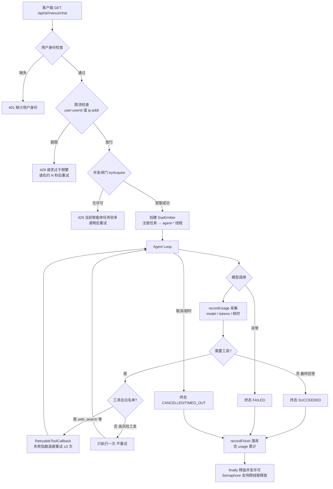

# 05 - Agent 弹性与可观测性：并发控制、限流、Usage、工具重试与健康检查

> 本文档与当前代码库完全一致，面向已有 Java / Spring Boot 基础、正在学习 Agent 生产化改造的开发者。
> 所有类名、方法名、配置项均来自本项目真实实现，无伪代码。

---

## 1. 本次功能目标

### 1.1 为什么 Agent 不能无限并发

| 风险 | 说明 |
| --- | --- |
| 成本放大 | 每个 Agent 任务都要多轮调用付费大模型，并发无上限时成本线性放大 |
| 下游限流 | 模型服务商（如 DashScope）本身有 QPS / 并发配额，打爆后所有请求一起失败 |
| 线程耗尽 | Agent 任务大量时间阻塞在模型 HTTP 调用上，线程池被长任务占满，普通接口跟着遭殃 |
| 无法降级 | 没有"满了就拒绝"的闸门，只能眼睁睁看着队列越堆越长、延迟越来越高 |

### 1.2 为什么要限流

并发闸门管的是"全局总量"，限流管的是"单个用户的份额"：

- 一个脚本用户一秒钟发 100 个 Agent 请求，就能把 8 个并发许可全部占住，其他用户全部被拒；
- 限流把单用户频率压到合理范围（本项目默认每分钟 10 次），保证资源公平；
- 限流拒绝要**快**（在 Controller 层、创建 SSE 连接之前），不能等任务排队。

### 1.3 为什么要记录成本（Usage）

- Token 是 Agent 的直接成本，不记录就无法对账、无法发现异常消耗；
- 有了 `runId → model → prompt/completion/total tokens → 耗时` 的落库记录，
  才能回答"这次任务花了多少钱、慢在哪一步"；
- 也是后续按模型计费、按用户配额的必要数据基础。

### 1.4 本次五大目标

1. **全局并发控制**：Semaphore 上限 8，满了返回 `当前智能体任务较多，请稍后重试。`，任何终态都释放许可；
2. **用户请求限流**：每分钟 10 次，原子计数，友好提示 + 建议等待秒数，不影响普通接口；
3. **模型 Usage**：每轮模型调用采集 tokens 与耗时，随终态落库 `agent_run`；
4. **工具重试**：只对只读幂等工具（web_search / web_scrape）指数退避重试，高风险工具绝不重试；
5. **健康检查**：Actuator health 检查 DB 与模型配置（轻量级，不发真实模型请求），只暴露 health。

---

## 2. 实现前项目状态：AgentExecutor 与线程池能控制什么、不能控制什么

改造前项目已有 `agentExecutor` 线程池（见 `AgentExecutorConfig`），但它的能力有明确边界：

| 能力 | 线程池 | 说明 |
| --- | --- | --- |
| 限制同时执行的线程数 | ✅ 能 | 核心/最大线程数决定 |
| 限制"同时存活的 Agent 任务数" | ❌ 不能 | 任务阻塞在模型 HTTP 调用上也占着一个线程，且线程数 ≠ 业务上允许的任务数 |
| 拒绝超量请求并给出业务提示 | ❌ 不能 | 线程池满了只会走拒绝策略（抛异常或丢弃），不是业务语义 |
| 按用户限流 | ❌ 不能 | 线程池不感知用户身份 |
| 统计 Token 成本 | ❌ 不能 | 与线程调度完全无关 |

改造前还有这些具体不足：

| 不足 | 后果 |
| --- | --- |
| 无并发闸门 | 任意多任务同时跑，成本与下游限流风险不可控 |
| 无限流 | 单用户脚本可独占全部资源 |
| `ChatResponse` 的 usage 被直接丢弃 | 每轮模型调用的 Token 消耗无任何记录 |
| 工具失败不重试 | 网络搜索这类临时性抖动直接变成任务失败 |
| 无健康检查 | 部署后无法被探针感知，DB / 模型配置错误发现太晚 |

---

## 3. 核心概念

### 3.1 Semaphore：全局并发闸门

`Semaphore` 维护 N 个许可：`tryAcquire()` 拿不到立即返回 `false`（不阻塞），
`release()` 归还一个。**关键特性：许可可以在 A 线程获取、B 线程释放**——
本项目正是"Web 线程获取、`agent-*` 后台线程释放"。

真实代码见 [AgentConcurrencyGuard](file:///D:/mk-agent/src/main/java/com/example/mkagent/resilience/AgentConcurrencyGuard.java)：

```java
this.semaphore = new Semaphore(maxConcurrency, true);   // 公平模式，先到先得

public boolean tryAcquire() {
    boolean acquired = semaphore.tryAcquire();          // 不阻塞等待
    if (!acquired) {
        log.warn("Agent 并发已满，拒绝新任务：maxConcurrency={}, available={}",
                maxConcurrency, semaphore.availablePermits());
    }
    return acquired;
}
```

为什么用 `tryAcquire` 而不是 `acquire`：拿不到就立刻拒绝（429），
绝不让请求在队列里堆积——堆积只会把延迟拖长，最后还是失败。

**许可不泄漏的纪律**：只有成功获取的一方才能释放，且只释放一次。
`BaseAgent` 用"获取后紧跟 try/finally"的结构保证这一点（见第 6 节）。

### 3.2 固定窗口限流与原子性

本项目当前没有 Redis 依赖，限流用**进程内固定窗口**实现，
接口抽象保留 Redis 扩展点（见 3.3）。

固定窗口算法：把时间切成 60 秒的窗口，每个限流键在当前窗口内最多放行 N 次。
核心难点是**并发计数的原子性**——"读计数 → 判断 → 加一"三步若被打断就会超发。

真实代码见 [InMemoryAgentRateLimiter](file:///D:/mk-agent/src/main/java/com/example/mkagent/resilience/InMemoryAgentRateLimiter.java)，
用 `AtomicReference<long[]>` + CAS 循环把三步变成一个原子操作：

```java
while (true) {
    long[] current = window.state.get();           // [窗口编号, 计数]
    long[] next = (current[0] != windowIndex)
            ? new long[]{windowIndex, 1}           // 新窗口：重置为 1
            : new long[]{windowIndex, current[1] + 1};
    if (window.state.compareAndSet(current, next)) {
        if (next[1] <= maxRequests) return RateLimitResult.allow(maxRequests);
        rollback(window, windowIndex);             // 超限：归还名额再拒绝
        return RateLimitResult.reject(maxRequests, waitSeconds);
    }
    // CAS 失败说明有并发竞争，重读重试
}
```

固定窗口的已知局限：窗口切换瞬间理论上可能出现 2 倍流量（滑动窗口可解决），
对"防脚本刷接口"的场景完全够用。

### 3.3 Redis 限流（扩展点）

若项目引入 Redis，标准做法是 `INCR key` + `EXPIRE key 60`（两条命令存在竞态窗口），
更严谨的是单条 Lua 脚本保证原子：

```lua
local count = redis.call('INCR', KEYS[1])
if count == 1 then
    redis.call('EXPIRE', KEYS[1], ARGV[1])
end
if count > tonumber(ARGV[2]) then
    return -1                       -- 被限流
end
return tonumber(redis.call('TTL', KEYS[1]))
```

本项目的切换方式：`AgentRequestRateLimiter` 是接口，
新增一个 `RedisAgentRateLimiter implements AgentRequestRateLimiter`，
用 `@Primary` 或条件装配替换 Bean 即可，`AiController` 一行不用改。
限流键解析集中在 `AiController.checkAgentRateLimit` 一处
（`user:{userId}` 优先，无身份时临时回退 `ip:{remoteAddr}`），
后续接入真实用户体系也只改这一处。

### 3.4 Token Usage：Spring AI 1.0.0 的真实接口

Spring AI 1.0.0 中 `ChatResponse.getMetadata()` 返回 `ChatResponseMetadata`，
其中 `getUsage()` 返回 `org.springframework.ai.chat.metadata.Usage`：

```java
public interface Usage {
    Integer getPromptTokens();      // 注意是 Integer，可能为 null
    Integer getCompletionTokens();  // 注意是 Integer，可能为 null
    Object getNativeUsage();        // 服务商原生 usage 对象
}
```

两个坑：

1. **返回值是 `Integer` 不是 `long`**：部分模型/场景不返回 usage，必须空安全；
2. **流式调用默认拿不到 usage**：DashScope 等服务商的流式响应只在最后一个分片携带
   usage，且需要显式开启 `stream_options.include_usage`。
   本项目 Agent 路径用非流式 `chatModel.call(prompt)`，可稳定获得 usage；
   流式聊天路径**不统计 usage**，避免为拿 usage 改变 SSE 订阅逻辑、破坏现有输出。

### 3.5 指数退避与幂等

**指数退避**：第 n 次失败后等待 `initialBackoff * multiplier^(n-1)`
（本项目 200ms → 400ms），比固定间隔更友好：临时抖动快速恢复，
持续故障不再密集打击下游。

**幂等**：同一操作执行一次与执行多次效果相同。重试只允许用于幂等工具：

| 工具 | 是否幂等 | 是否允许重试 |
| --- | --- | --- |
| `web_search` / `web_scrape` | 是（只读查询） | ✅ |
| `write_file` / `download_resource` | 否（有副作用） | ❌ |
| `generate_pdf` | 否（生成文件） | ❌ |
| `terminate_task` | 否（改变任务状态） | ❌ |

对非幂等工具重试的后果：重复写文件、重复下载、重复扣费。

### 3.6 Actuator HealthIndicator

Spring Boot Actuator 的 `/actuator/health` 聚合所有 `HealthIndicator`：
任一组件 DOWN 则整体 DOWN。数据源健康检查由
`spring-boot-starter-actuator` + 数据源自动提供（`components.db`）。

自定义指示器只需实现接口：

```java
@Component("aiModel")                    // 组件名 → components.aiModel
public class AiModelHealthIndicator implements HealthIndicator {
    @Override
    public Health health() {
        // 只检查配置可用性，绝不发起真实模型请求
        return Health.up().withDetail("apiKey", maskKey(apiKey)).build();
    }
}
```

**为什么健康检查不能调真实模型**：一次真实调用产生 Token 费用、依赖外网、
拖慢探针（探针超时会被 K8s 误杀实例）。只检查"配置是否就绪"即可。

---

## 4. 请求全链路流程图



文本版：

```
请求 → 用户身份 → 限流（429 提示+等待秒数）→ 并发闸门（429 业务文案）
→ SSE + agent-* 线程执行 → 每轮模型调用采集 Usage
→ 白名单工具失败自动重试 / 高风险工具只执行一次
→ 任意终态 → recordFinish 落库（tokens/耗时）→ finally 释放许可
```

---

## 5. 文件变更表格

### 5.1 新增文件

| 文件 | 职责 |
| --- | --- |
| `src/main/java/com/example/mkagent/resilience/AgentConcurrencyGuard.java` | Semaphore 全局并发闸门（公平模式，默认 8） |
| `src/main/java/com/example/mkagent/resilience/AgentRequestRateLimiter.java` | 限流接口（Redis 扩展点） |
| `src/main/java/com/example/mkagent/resilience/InMemoryAgentRateLimiter.java` | 进程内固定窗口限流（CAS 原子） |
| `src/main/java/com/example/mkagent/resilience/RateLimitResult.java` | 限流结果（allowed / limit / waitSeconds） |
| `src/main/java/com/example/mkagent/resilience/RetryableToolCallback.java` | 工具重试装饰器（指数退避 + 中断感知） |
| `src/main/java/com/example/mkagent/resilience/ToolRetryWrapper.java` | 按白名单包装工具（非白名单原样返回） |
| `src/main/java/com/example/mkagent/health/AiModelHealthIndicator.java` | 模型配置轻量级健康检查（不发真实请求） |
| `src/test/java/com/example/mkagent/resilience/InMemoryAgentRateLimiterUnitTest.java` | 限流单元测试（含 50 线程并发原子性验证） |
| `src/test/java/com/example/mkagent/resilience/RetryableToolCallbackUnitTest.java` | 工具重试单元测试（含真实 ToolCallingManager） |
| `src/test/java/com/example/mkagent/resilience/AgentConcurrencyLimitIntegrationTest.java` | 并发上限 + 许可释放集成测试 |
| `src/test/java/com/example/mkagent/resilience/AgentRateLimitIntegrationTest.java` | 限流集成测试（真实 HTTP） |
| `src/test/java/com/example/mkagent/resilience/ToolRetryIntegrationTest.java` | 工具重试集成测试（真实 Agent 链路） |
| `src/test/java/com/example/mkagent/health/AgentHealthIntegrationTest.java` | 健康端点集成测试 |

### 5.2 修改文件

| 文件 | 变更 |
| --- | --- |
| `pom.xml` | 新增 `spring-boot-starter-actuator`；新增 `project.build.sourceEncoding=UTF-8`（修复中文常量被 GBK 编译成乱码） |
| `agent/BaseAgent.java` | 注入并发闸门；`run()` 最外层 finally 释放；`runStream()` 异步 finally + 同步段 catch 双保险释放 |
| `agent/MkManus.java` | 构造器注入 `AgentConcurrencyGuard` |
| `agent/ToolCallAgent.java` | 模型调用计时 + `recordUsage` 采集 tokens（Integer 空安全） |
| `model/AgentRunContext.java` | 新增 usage 累计字段 + `addModelUsage` |
| `entity/AgentRunEntity.java` | 新增 model / prompt_tokens / completion_tokens / total_tokens |
| `service/AgentRunRecorder.java` | `recordFinish` 条件写入 usage（totalTokens=0 保持 NULL） |
| `model/vo/AgentRunVO.java` | 新增 usage 字段与映射 |
| `resources/db/schema.sql` | 新增 4 列 + `ALTER TABLE ADD COLUMN IF NOT EXISTS` 存量升级 |
| `controller/AiController.java` | `/ai/manus/chat` 接入限流（仅 Agent 接口） |
| `config/AgentToolProvider.java` | 工具经 `ToolRetryWrapper` 包装后输出 |
| `exception/GlobalExceptionHandler.java` | 新增 `NoResourceFoundException` 处理（未暴露端点返回 404 而非 500） |
| `resources/application.yml` | Actuator 只暴露 health；`mkagent.agent/rate-limit/tool-retry` 三组配置 |
| `config/AgentToolWhitelistTest.java` | 构造器适配新增的 `ToolRetryWrapper` 参数 |
| `support/FakeChatModel.java` | 响应携带 fake-model + 固定 usage（10/5）元数据 |

---

## 6. 核心代码讲解

### 6.1 并发许可的获取与释放（BaseAgent）

同步路径：获取后紧跟 try/finally，finally 覆盖成功/失败/取消/超时所有分支：

```java
public String run(String userPrompt) {
    // ...参数校验
    acquireConcurrencyPermit();          // 拿不到直接抛 BusinessException(429)
    try {
        // 原有全部逻辑（内部还有自己的 try/catch/finally）
    } finally {
        releaseConcurrencyPermit();      // 任何终态后必然执行
    }
}
```

流式路径稍复杂——**获取在 Web 线程，释放在后台线程**：

```java
public SseEmitter runStream(String userPrompt) {
    acquireConcurrencyPermit();
    try {
        // 创建 emitter、注册任务……
        CompletableFuture.runAsync(() -> {
            try {
                // Agent Loop
            } finally {
                recordRunFinish(...);
                releaseConcurrencyPermit();   // 后台线程释放（Semaphore 支持）
            }
        }, agentExecutor);
        return emitter;
    } catch (RuntimeException e) {
        releaseConcurrencyPermit();           // 提交前失败（如线程池拒绝）
        throw e;
    }
}
```

为什么同步段还需要 catch 释放：如果异步任务**提交成功**，释放由后台线程负责；
如果在提交前抛异常（如线程池拒绝），后台 finally 不会执行，必须由同步段释放，
否则许可永久泄漏。

### 6.2 限流接入点（AiController）

```java
private void checkAgentRateLimit(HttpServletRequest request) {
    String userId = UserContextHolder.get();
    // 限流键解析：后续切换真实用户体系的唯一扩展点
    String rateLimitKey = (userId != null && !userId.isBlank())
            ? "user:" + userId : "ip:" + request.getRemoteAddr();

    RateLimitResult result = agentRequestRateLimiter.tryAcquire(rateLimitKey);
    if (!result.allowed()) {
        throw new BusinessException(429,
                "请求过于频繁，请在约 " + result.waitSeconds()
                        + " 秒后重试（限制：每分钟最多 "
                        + result.limit() + " 次 Agent 请求）。");
    }
}
```

注意顺序：`requireUserId()` → `checkAgentRateLimit()` → `mkManus.runStream()`，
限流发生在创建 SSE 连接与获取并发许可之前，被限流的请求成本几乎为零。
普通聊天接口（`/ai/chat_app/**`）与查询接口（`/ai/runs/**`）完全不经过它。

### 6.3 Usage 采集（ToolCallAgent）

```java
long modelCallStart = System.currentTimeMillis();
ChatResponse response = chatModel.call(prompt);
long modelCallCost = System.currentTimeMillis() - modelCallStart;
recordUsage(ctx, response, modelCallCost);
```

```java
private void recordUsage(AgentRunContext ctx, ChatResponse response, long cost) {
    try {
        Usage usage = response.getMetadata().getUsage();
        long promptTokens = safeTokens(usage == null ? null : usage.getPromptTokens());
        long completionTokens = safeTokens(usage == null ? null : usage.getCompletionTokens());
        long totalTokens = promptTokens + completionTokens;
        ctx.addModelUsage(response.getMetadata().getModel(),
                promptTokens, completionTokens, totalTokens, cost);
    } catch (Exception e) {
        log.warn("模型 Usage 采集失败（不影响任务主流程）", e);
    }
}
```

三个设计点：

1. `safeTokens(Integer)`：usage 可能整体为 null，单个字段也可能为 null，全部按 0 处理；
2. 外层 try-catch：**采集失败绝不中断任务**，Usage 是观测数据不是主流程；
3. 落库语义：`totalTokens = 0` 时 `recordFinish` 不写 Token 列（保持 NULL），
   区分"模型未提供 usage"与"真实消耗为 0"。

### 6.4 工具重试装饰器（RetryableToolCallback）

```java
for (int attempt = 1; attempt <= maxAttempts; attempt++) {
    if (Thread.currentThread().isInterrupted()) {
        throw new RuntimeException(new InterruptedException(
                "工具重试被任务取消中断：" + toolName));
    }
    try {
        String result = invocation.invoke();
        if (!isFailureResult(result)) {
            return result;                       // 成功（可能是重试后成功）
        }
        lastFailure = new RuntimeException("工具返回失败结果：" + truncate(result));
    } catch (RuntimeException e) {
        lastFailure = e;
    }
    retryCount.incrementAndGet();                // 记录重试次数
    if (attempt == maxAttempts) break;           // 最后一次失败不再等待
    sleepBeforeRetry(backoffMillis);             // 指数退避（可被中断）
    backoffMillis = (long) (backoffMillis * multiplier);
}
throw lastFailure;                               // 耗尽后抛出最终失败原因
```

两个容易踩的细节：

1. **失败识别用 `contains` 不是 `startsWith`**：`@Tool` 方法经 `MethodToolCallback`
   执行时，返回值会被序列化为 JSON 字符串（外层包裹双引号），
   失败文案不在字符串最开头。用前缀匹配会导致重试静默失效；
2. **中断感知**：任务被取消后，重试循环立即退出，
   不会出现"任务已取消还在重试等待"的资源浪费。

工具定义完全透传（`getToolDefinition()` 返回被装饰者的定义），
模型看到的工具名、描述、参数毫无变化，重试对模型无感知。

### 6.5 健康检查配置

```yaml
management:
  endpoints:
    web:
      exposure:
        include: health        # 只暴露 health，不含 env/beans/heapdump
  endpoint:
    health:
      show-details: always     # 生产可改 never 进一步收敛
```

`GET /api/actuator/health` 响应结构：

```json
{
  "status": "UP",
  "components": {
    "db": { "status": "UP" },
    "aiModel": {
      "status": "UP",
      "details": { "apiKey": "sk-ws-***", "chatModel": "...", "model": "qwen-plus" }
    }
  }
}
```

---

## 7. 手撕实现步骤

1. **并发闸门**：新建 `AgentConcurrencyGuard`（Semaphore + `@Value` 配置上限）；
2. **接入 BaseAgent**：`run()` 最外层 try/finally；`runStream()` 异步 finally + 同步段 catch；
3. **注入闸门**：`MkManus` 构造器加参数 → `setConcurrencyGuard`；
4. **限流接口**：`AgentRequestRateLimiter` + `RateLimitResult` record；
5. **内存实现**：`InMemoryAgentRateLimiter`（CAS 固定窗口，超限回滚名额）；
6. **接入 Controller**：只在 `/ai/manus/chat` 调用，键为 `user:` 优先 `ip:` 回退；
7. **Usage 采集**：`ToolCallAgent` 模型调用计时 + 空安全提取 + `ctx.addModelUsage`；
8. **Usage 落库**：`AgentRunContext` 累计字段 → `schema.sql` 加列（含 `ALTER IF NOT EXISTS`）
   → Entity/Recorder/VO 三件套；
9. **重试装饰器**：`RetryableToolCallback`（异常 + 失败文案双识别，指数退避，中断感知）；
10. **白名单包装**：`ToolRetryWrapper` 按 `retryable-tools` 配置，`AgentToolProvider.getTools()` 出口包装；
11. **健康检查**：pom 加 actuator、yml 只暴露 health、自定义 `AiModelHealthIndicator`；
12. **编码防御**：pom 声明 `project.build.sourceEncoding=UTF-8`（中文常量不乱码）；
13. **测试**：单元（限流原子性 / 重试边界）+ 集成（HTTP 全链路六类验证）。

---

## 8. 配置说明

| 配置项 | 默认值 | 说明 |
| --- | --- | --- |
| `mkagent.agent.max-concurrency` | `8` | 全局最大并发 Agent 任务数（Semaphore 许可数） |
| `mkagent.rate-limit.enabled` | `true` | 限流总开关 |
| `mkagent.rate-limit.max-requests` | `10` | 单用户每窗口最多 Agent 请求数 |
| `mkagent.rate-limit.window-seconds` | `60` | 限流窗口长度 |
| `mkagent.tool-retry.enabled` | `true` | 工具重试总开关 |
| `mkagent.tool-retry.max-attempts` | `3` | 最大尝试次数（含首次），绝不无限重试 |
| `mkagent.tool-retry.initial-backoff-millis` | `200` | 首次重试前等待毫秒 |
| `mkagent.tool-retry.multiplier` | `2.0` | 退避倍数（200 → 400 → …） |
| `mkagent.tool-retry.retryable-tools` | `web_search,web_scrape` | 允许重试的工具白名单 |
| `mkagent.tool-retry.failure-markers` | `web_search:搜索工具执行失败,...` | 吞异常失败文案识别关键词（包含匹配） |
| `management.endpoints.web.exposure.include` | `health` | Actuator 只暴露 health |
| `management.endpoint.health.show-details` | `always` | 生产建议改 `never` |

---

## 9. 测试命令和结果

所有测试均不触网、不调用真实模型、不依赖外部数据库（H2 内存库 PostgreSQL 兼容模式）。

```powershell
# 单元测试
.\mvnw.cmd test -Dtest=InMemoryAgentRateLimiterUnitTest
.\mvnw.cmd test -Dtest=RetryableToolCallbackUnitTest

# 集成测试（逐个运行，PowerShell 下避免逗号列表）
.\mvnw.cmd test -Dtest=AgentConcurrencyLimitIntegrationTest
.\mvnw.cmd test -Dtest=AgentRateLimitIntegrationTest
.\mvnw.cmd test -Dtest=ToolRetryIntegrationTest
.\mvnw.cmd test -Dtest=AgentHealthIntegrationTest

# 全量回归（注意：日志不要写到 target 目录内，否则 clean 阶段删不掉）
.\mvnw.cmd clean test
```

**全量回归结果**：`Tests run: 67, Failures: 0, Errors: 0, Skipped: 0 —— BUILD SUCCESS`（2 分 14 秒）。
存量工具链测试（MkManusAsyncSseIntegrationTest、AgentTaskCancelIntegrationTest、AgentToolWhitelistTest、
各工具单测、chatApp / RAG 测试等）全部继续通过，本次改造未破坏任何既有能力。

### 9.1 六类验证点与测试对应

| 验证点 | 测试 | 结果 |
| --- | --- | --- |
| 1. 并发上限生效 | `thirdRequestRejectedWhenConcurrencyFull`：上限调为 2，2 任务挂起后第 3 请求 429 且含指定文案 | ✅ 4/4 通过 |
| 2. 完成/失败/取消后许可释放 | `permitsNotLeakedAfterSequentialRuns` / `permitReleasedAfterFailure` / `permitReleasedAfterCancel` | ✅ |
| 3. 单用户超频被限流 | `singleUserLimitedAfterMaxRequests`（3 放行 + 第 4 次 429 含等待秒数）、`otherUserNotAffectedByOneUsersLimit`、`nonAgentEndpointNotAffectedByRateLimit` | ✅ 3/3 通过 |
| 4. 可重试工具临时失败后成功 | 单元 `retryOnExceptionThenSucceed` / `retryOnFailureMarkerTextThenSucceed`；集成 `retryableToolSucceedsAfterTransientFailure`（工具恰好调用 2 次，任务正常产出 final_answer） | ✅ 通过 |
| 5. 不可重试工具不被重复执行 | `highRiskToolIsNeverWrapped`（assertSame 原样返回）+ `nonRetryableToolExecutedExactlyOnceThroughToolCallingManager`（真实 ToolCallingManager 执行恰好 1 次，失败结果以 ToolResponseMessage 写回） | ✅ 通过 |
| 6. health 端点反映依赖状态 | `healthEndpointReflectsDependencyStatus`（整体/db/aiModel 均 UP，apiKey 脱敏）+ `sensitiveActuatorEndpointsAreNotExposed`（env/heapdump 404） | ✅ 2/2 通过 |
| 补充：Usage 落库 | `AgentRunPersistenceIntegrationTest#runPersistsModelUsage`（fake-model，prompt=20 / completion=10 / total=30） | ✅ 通过 |

### 9.2 关键日志证据

限流生效：

```
WARN  InMemoryAgentRateLimiter : Agent 请求被限流：key=user:user-rl-query, limit=3, waitSeconds=58
WARN  GlobalExceptionHandler   : 业务异常：status=429, message=请求过于频繁，请在约 58 秒后重试（限制：每分钟最多 3 次 Agent 请求）。
```

工具重试生效：

```
WARN  RetryableToolCallback : 工具执行失败，准备重试：tool=web_search, attempt=1/3, backoff=1ms, reason=工具返回失败结果："搜索工具执行失败：模拟网络超时"
INFO  RetryableToolCallback : 工具重试成功：tool=web_search, attempt=2/3, totalRetries=1
```

Usage 落库：

```
INFO  AgentRunRecorder : AgentRun 终态已持久化：runId=..., state=SUCCEEDED, model=fake-model, totalTokens=30
```

---

## 10. 常见问题表

| 问题 | 现象 | 原因 | 解决 |
| --- | --- | --- | --- |
| 许可泄漏 | 可用许可只减不增，最终所有请求被 429 | 获取后某条异常路径没有释放（获取与释放不在配对的 try/finally 中） | 获取后紧跟 `try { ... } finally { release(); }`；异步任务"提交前失败"必须由同步段释放；可用许可数纳入监控告警 |
| 限流非原子 | 高并发下实际放行数超过阈值 | "读计数→判断→加一"三步被打断 | 进程内用 CAS（本项目）；Redis 用单条 `INCR+EXPIRE` 或 Lua 脚本，禁止应用层先读后写 |
| 重复执行高风险工具 | 文件被写两次、重复下载 | 把写操作类工具放进了重试白名单 | 白名单默认只含只读工具；新增工具必须证明幂等才能加入 |
| 重试静默失效 | 失败文案出现了却没重试 | `MethodToolCallback` 把返回值序列化成 JSON（外层双引号），`startsWith` 匹配不上 | 用 `contains` 包含匹配（本项目已修正） |
| 流式 Usage 缺失 | 流式聊天没有 Token 记录 | 服务商流式响应默认不带 usage（需 `stream_options` 且只在最后分片返回） | Agent 路径用非流式 `call()` 稳定采集；流式路径明确不统计，不为 usage 破坏 SSE |
| 中文常量乱码 | 失败标记、限流提示运行时对不上 | 中文 Windows 默认 GBK 编译，UTF-8 源码中的中文常量被编译成乱码 | pom 显式声明 `project.build.sourceEncoding=UTF-8` |
| 未暴露端点返回 500 | `/actuator/env` 报 500 而非 404 | `@RestControllerAdvice` 的 `Exception` 兜底处理器拦截了 `NoResourceFoundException` | 为 `NoResourceFoundException` 单独处理，保留其自带状态码 |
| 健康检查拖垮探针 | 探针超时、实例被误杀 | 健康检查发起了真实模型/外网请求 | 只做配置可用性静态检查（本项目 `AiModelHealthIndicator`） |

---

## 11. 面试题

**Q1：为什么用 Semaphore 而不是直接调小线程池来控制 Agent 并发？**

线程池限制的是"同时执行的线程数"，不是"业务允许的任务数"；且线程池满了走拒绝策略抛 `RejectedExecutionException`，不是业务语义。Semaphore 提供"获取不到立刻拒绝 + 友好文案 + 跨线程释放"，与线程池解耦：线程池管执行资源，闸门管业务配额。

**Q2：异步任务里许可的获取和释放分别在哪个线程？为什么不会出错？**

Web 线程获取（`runStream` 同步段），`agent-*` 后台线程在 finally 释放。`Semaphore` 的许可只是计数器，不绑定获取线程，天然支持跨线程释放。风险在于"提交异步任务前抛异常"——此时后台 finally 不会执行，所以同步段还要有 catch 释放兜底。

**Q3：固定窗口限流和滑动窗口限流的区别？你的实现如何升级成滑动窗口？**

固定窗口在窗口切换瞬间理论上允许 2 倍流量（前后两个窗口各满额）。升级方案：① 进程内用"当前窗口 + 上一窗口按剩余时间加权"；② Redis 用 ZSET 存每次请求时间戳（`ZREMRANGEBYSCORE` + `ZCARD`），或用多个小窗口桶累加。本项目接口化设计（`AgentRequestRateLimiter`）允许直接换实现。

**Q4：为什么不能对 `write_file` 这类工具自动重试？如果业务坚持要重试怎么办？**

写操作非幂等，重试可能产生重复文件、重复扣费等不可逆副作用。若业务坚持：① 让工具自身实现幂等（如带幂等键、先查后写）；② 用"恰好一次"语义（写入前检查目标状态）；③ 把决策权交给模型——失败结果写回上下文，由模型决定是否再次调用（本项目对非白名单工具正是这种语义）。

**Q5：Spring AI 里如何拿到 Token Usage？有哪些坑？**

`chatResponse.getMetadata().getUsage()`。坑：① `getPromptTokens()` 返回 `Integer` 可能为 null，必须空安全；② 流式响应默认不携带 usage（DashScope 需开启 `stream_options.include_usage` 且只在最后分片返回）；③ 不是所有模型都返回，落库要区分"未提供"（NULL）与"为 0"。

**Q6：指数退避中为什么要加随机抖动（jitter）？本项目为什么没加？**

大量客户端同时重试会形成"重试风暴"，抖动把重试时间打散。本项目是单进程内的工具级重试（并发量小、退避总时长 < 1 秒），抖动收益有限；若升级为分布式客户端重试（如调用模型 API 的重试），必须加抖动。

**Q7：Actuator 生产环境怎么配置才安全？**

① `exposure.include` 白名单制，只暴露 health（必要时加 prometheus）；② `show-details` 设 `never` 或 `when-authorized`；③ 健康检查实现不发真实外部请求；④ 敏感端点（env/heapdump）绝不暴露——它们可导出密钥与内存数据；⑤ 如需暴露更多信息，用 Spring Security 限制端点访问权限。

**Q8：一个用户的脚本刷爆了接口，你的系统会怎么反应？**

第一道：限流（每分钟 10 次）在 Controller 层拒绝，成本几乎为零；第二道：即使绕过限流（如换大量 IP），并发闸门保证最多 8 个任务同时执行，多余请求被 429 快速拒绝；同时 Usage 落库能定位异常消耗来源。三层防线：限流保公平、并发保总量、观测保定位。

---

## 12. 后续优化

| 方向 | 说明 |
| --- | --- |
| 分布式限流 | 多实例部署时进程内限流失效，替换为 `RedisAgentRateLimiter`（Lua 原子脚本），接口已预留 |
| 动态配额 | 限流阈值 / 并发上限接入配置中心（Nacos/Apollo）热更新，按用户等级差异化配额 |
| 按模型计费 | 基于 `agent_run` 的 usage 数据 × 模型单价表计算成本，输出按用户 / 按天账单 |
| Prometheus + Grafana | Micrometer 暴露并发占用、限流拒绝数、工具重试数、Token 消耗速率，配合告警 |
| 滑动窗口 / 令牌桶 | 限流算法升级，消除窗口切换瞬间的 2 倍流量问题 |
| 并发闸门分布式化 | 多实例下用 Redis + Lua 实现全局信号量，或网关层统一限流 |
